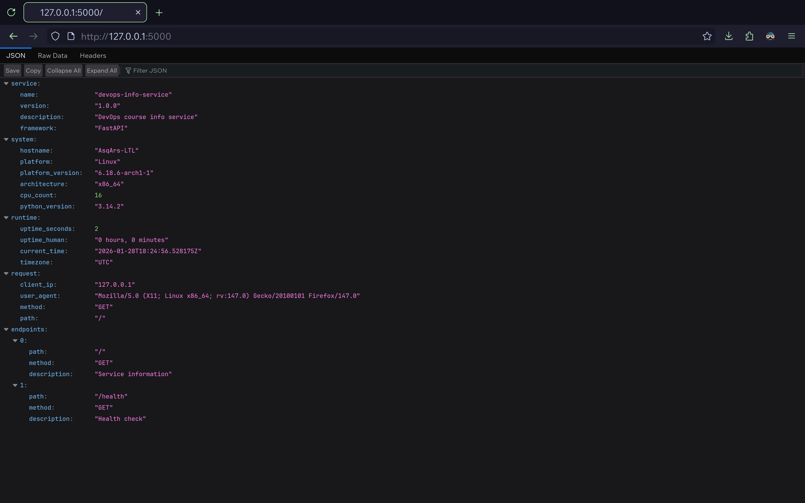
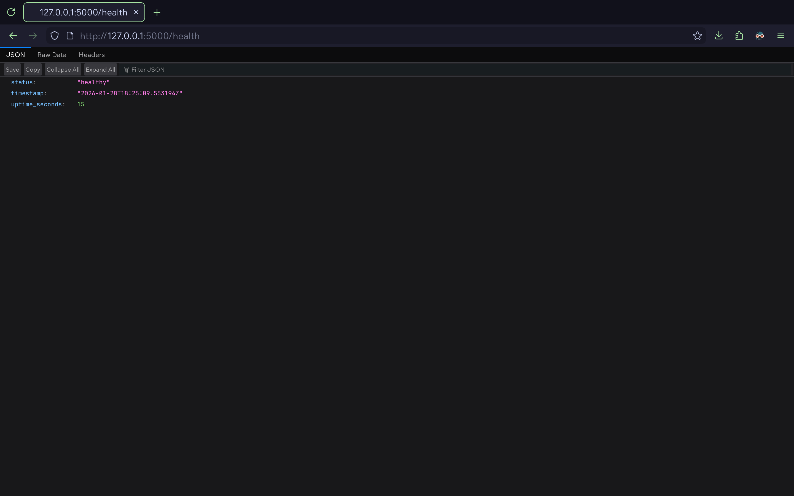
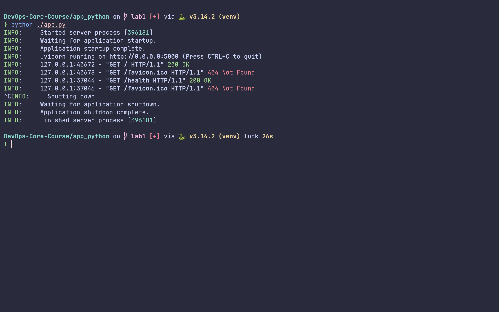

# Lab 1 Submission

## Framework Selection

I chose FastAPI for these reasons:

- Built-in request validation with Pydantic
- Modern async support
- Better performance than the alternatives
- Prior experience with the frammework

| Framework | Pros                         | Cons                     |
| --------- | ---------------------------- | ------------------------ |
| FastAPI   | Auto-docs, validation, async | Steeper learning curve   |
| Flask     | Simple, many extensions      | No built-in validation   |
| Django    | Full-featured, ORM           | Heavyweight for this use |

## Best Practices Applied

### 1. Clean Code Organization

- Used Pydantic models for type safety
- Grouped related functionality into classes
- Separated configuration from logic

### 2. Error Handling

```python
@app.exception_handler(404)
async def not_found_handler(...)
```

### 3. Logging

Configured through Uvicorn with proper log levels based on `DEBUG` mode.

### 4. Dependencies

Pinned exact versions in `requirements.txt` for reproducibility.

### 5. Configuration

Environment variables for `HOST`, `PORT`, and `DEBUG` with sensible defaults.

## API Documentation

### `GET /`

**Response:**

```json
{
  "service": {...},
  "system": {...},
  "runtime": {...},
  "request": {...},
  "endpoints": [...]
}
```

### `GET /health`

**Response:**

```json
{
  "status": "healthy",
  "timestamp": "2024-01-15T14:30:00.000Z",
  "uptime_seconds": 3600
}
```

## Testing

Run the service and test with `curl`:

```bash
curl http://localhost:5000
curl http://localhost:5000/health
```

## Challenges & Solutions

1. **Uptime calculation**: used application start time stored in `app.state`
2. **Type safety**: implemented Pydantic models for all responses
3. **Error handling**: added custom exception handlers for 404 and 500 errors

## GitHub Community

Starring repositories helps bookmark useful projects and shows appreciation to
maintainers. Following developers provides visibility into industry trends and
creates networking opportunities for professional growth.

## Screenshots

### Main Endpoint



### Health Check



### Formatted Output


