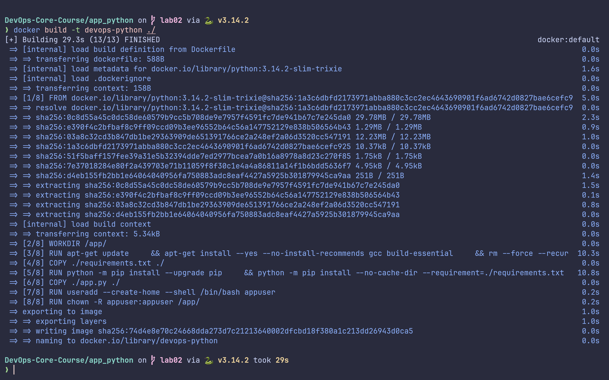
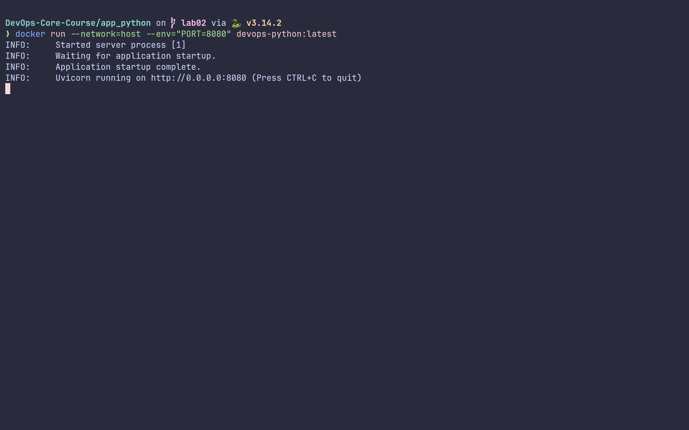
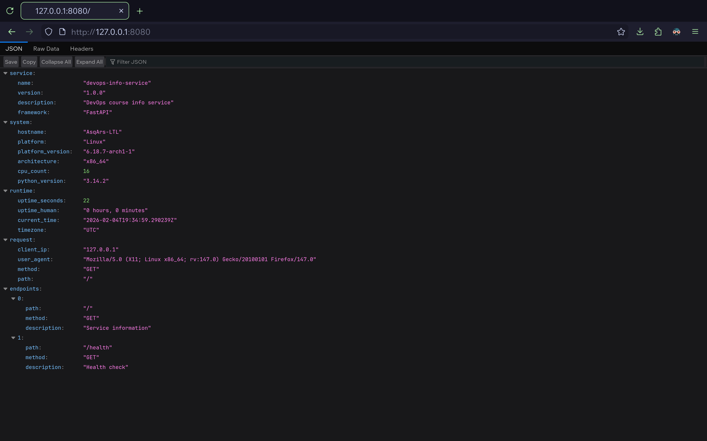

# LAB02: Docker Containerization (DevOps Info Service)

This document captures the Docker containerization of the Python-based DevOps
Info Service from Lab 1.

## 1. Docker Best Practices Applied

- Non-root user: The image creates and runs as a non-root user to reduce the
  risk surface.
- Layer caching: Dependencies are installed before copying application code to
  maximize cache hits on subsequent rebuilds.
- .dockerignore: Excludes non-essential files from the build context to speed up
  builds and reduce image size.
- Specific base image: Uses `python:3.14.2-trixie-slim` to balance compatibility
  with security and image size.
- Minimal final image: Only the application code and runtime dependencies are
  included in the final image.
- Exposure of only needed port: The container exposes port 5000 where the
  FastAPI service runs.

Why this matters: Separates concerns between build-time dependencies and
runtime, reduces attack surface, and enables efficient rebuilds via caching.

## 2. Image Information & Decisions

- Base image chosen: `python:3.14.2-trixie-slim` . Why: uses Python 3.14, while
  keeping the image lean; the `-slim` variant excludes many packages not needed
  at runtime.
- Final image size: relatively small (after removing build tools and caches);
  expected range ~50-150MB depending on dependencies.
- Layer structure: base OS + Python deps layer, app code layer, final non-root
  user layer. Keeping dependencies separate from code improves cache reuse.
- Optimization choices: installing system dependencies only when necessary;
  using `--no-cache-dir` for `pip`; removing `apt` lists after installation.

## 3) Build & Run Process

- Build (local):

```sh
docker build --tag=devops-lab02-python ./
```

- Run (publishable endpoint):

```sh
docker run --network=host devops-lab02-python
```

- Access app: <http://localhost:5000/>
- Pull from Docker Hub (after pushing):

```sh
docker pull asqarslanov/devops-lab02-python
```

- Docker Hub repository URL:
  <https://hub.docker.com/repository/docker/asqarslanov/devops-lab02-python/general>

Terminal outputs (example):

- 
- 
- 

## 4. Technical Analysis

- Why does this `Dockerfile` work as it does? It isolates build-time
  dependencies, uses a non-root user for security, and keeps the runtime image
  lean by copying only the necessary files after dependency installation.
- If you change layer order (e.g., copy `app.py` before installing requirements),
  you lose cache efficiency and you may rebuild dependencies more often than
  needed.
- Security considerations: Non-root user reduces risk in case of compromise;
  minimal base image and removal of package lists minimize the attack surface.
- .dockerignore improves build speed by excluding large folders (tests, docs,
  caches) from the build context.

## 5. Challenges & Solutions

- Challenge: Ensuring the app runs under a non-root user without permission
  issues. Solution: Create appuser and set ownership of `/app/` before switching
  user.
- Challenge: Keeping image small while still allowing compilation for some
  dependencies. Solution: Use a `slim` base, install only required system tools,
  clean caches.
- Challenge: Verifying endpoints from host. Solution: Use `docker run` with `-p`
  to map ports and `curl` from the host.
