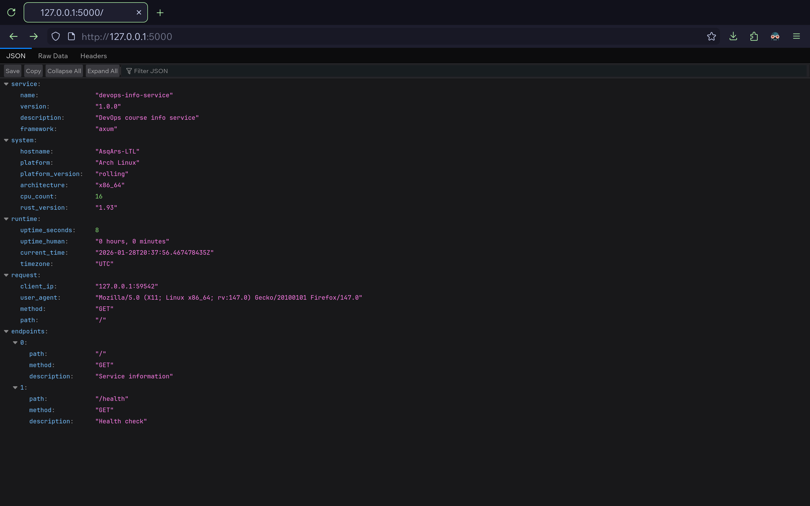
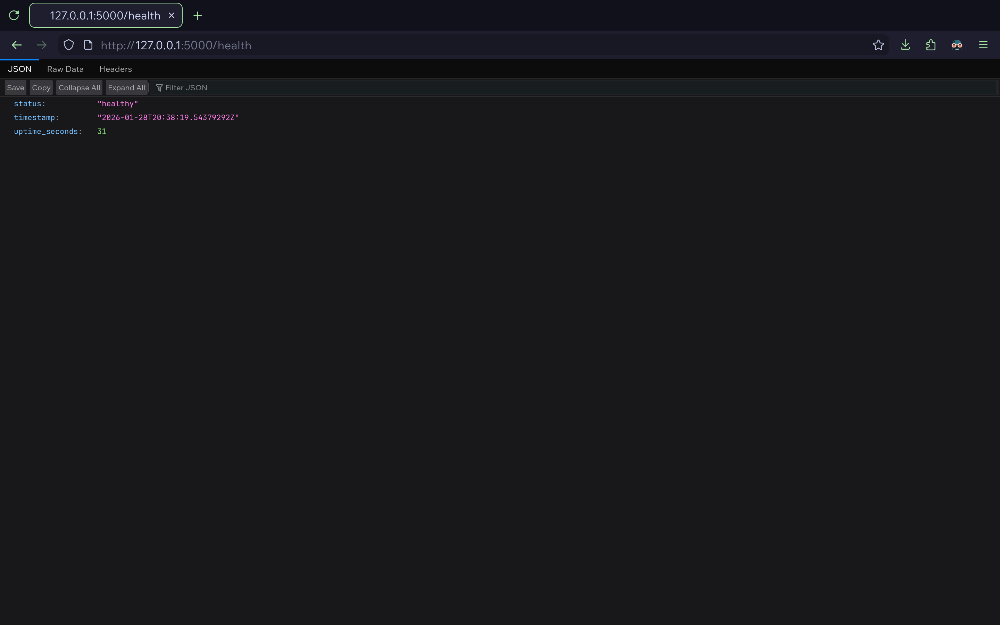
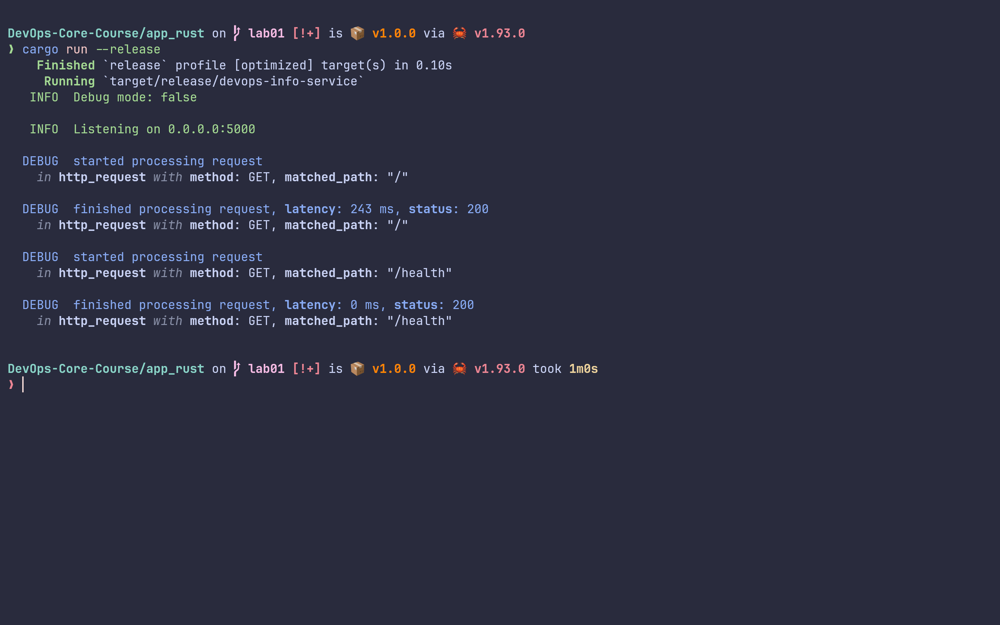

# Lab 1 Submission - Rust Implementation

## Framework Selection: Axum

I selected **Axum** as the web framework for this Rust implementation. Axum is
built on top of Tokio (Rust's async runtime) and Tower, providing a modern,
type-safe foundation for web applications.

**Why Axum?**

- **Performance**: Built on Tokio, one of the fastest async runtimes
- **Type Safety**: Leverages Rust's type system for compile-time route
  validation
- **Middleware**: Clean middleware system using Tower services
- **Ecosystem**: Part of the Tokio stack with excellent interoperability
- **Simplicity**: Minimal boilerplate while maintaining expressiveness

**Framework Comparison:**

| Framework | Language | Pros                         | Cons                   |
| --------- | -------- | ---------------------------- | ---------------------- |
| Axum      | Rust     | Type-safe, fast, async-first | Young ecosystem        |
| Actix-web | Rust     | Mature, feature-rich         | More complex           |
| Rocket    | Rust     | Easy to use, macro-based     | Less async support     |
| Flask     | Python   | Simple, extensive ecosystem  | Slower, synchronous    |
| FastAPI   | Python   | Fast, auto-docs, async       | Python GIL limitations |

## Best Practices

### Logging

Configured through `tracing` with proper log levels based on `DEBUG` mode.

### Dependencies

Pinned exact versions in `Cargo.toml` for reproducibility.

### Configuration

Environment variables for `HOST`, `PORT`, and `DEBUG` with sensible defaults.

## API Documentation

### `GET /`

**Response:**

```json
{
  "service": {...},
  "system": {...},
  "runtime": {...},
  "request": {...},
  "endpoints": [...]
}
```

### `GET /health`

**Response:**

```json
{
  "status": "healthy",
  "timestamp": "2024-01-15T14:30:00.000Z",
  "uptime_seconds": 3600
}
```

## Testing

Run the service and test with `curl`:

```bash
curl http://localhost:5000
curl http://localhost:5000/health
```

## GitHub Community

Starring repositories helps bookmark useful projects and shows appreciation to
maintainers. Following developers provides visibility into industry trends and
creates networking opportunities for professional growth.

## Screenshots

### Main Endpoint



### Health Check



### Formatted Output


