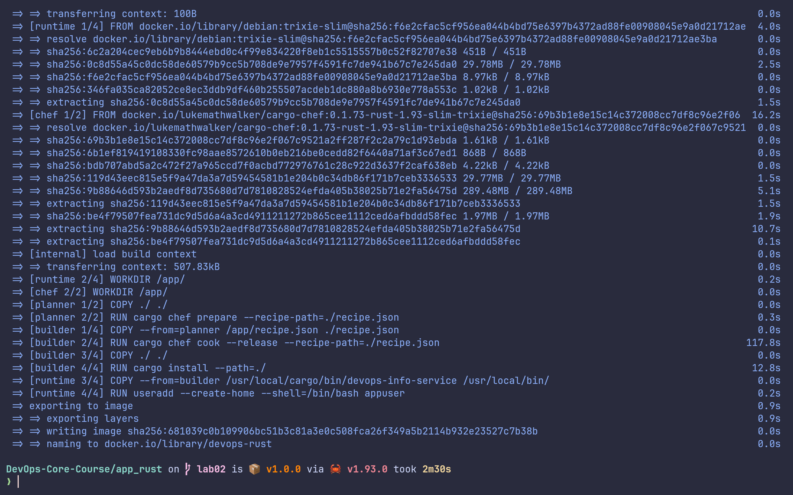
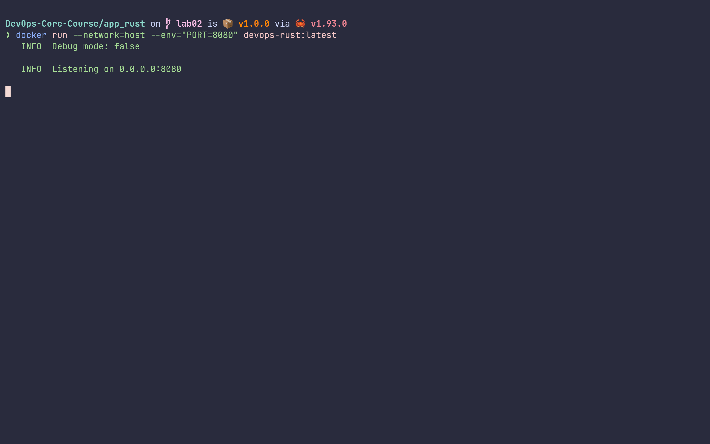
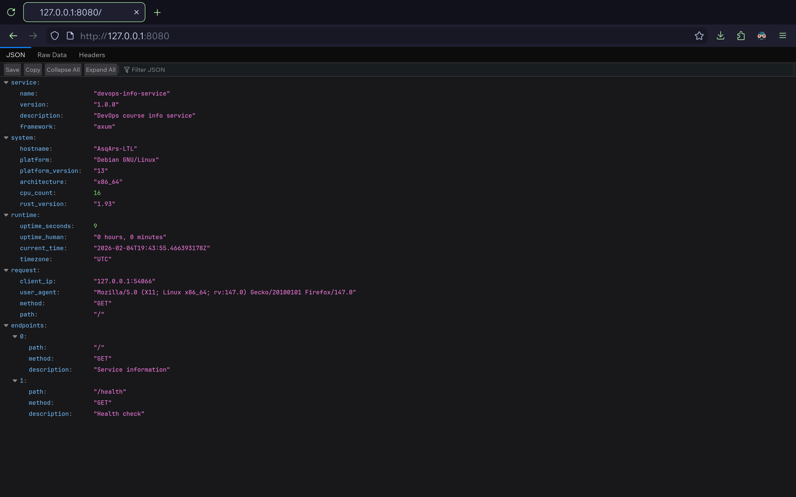

# LAB02: Rust Multi-Stage Docker Build

Overview: Containerize the Rust-based DevOps Info Service using cargo-chef
powered multi-stage Dockerfile to minimize the final image size and attack
surface.

- Multi-stage build with `cargo-chef`: Builder stages compile dependencies
  efficiently; runtime stage copies only the binary, avoiding the toolchain in
  the final image.
- Non-root runtime: The final image runs as a non-root user for security.
- Minimal runtime image: Uses debian:bookworm-slim as a small base, installs
  only CA certificates.
- Separate concerns: Build dependencies do not end up in the final image.
- Exposed port: 5000 to match the service configuration.

Why: `cargo-chef` speeds up rebuilds by caching dependencies, reducing
compilation time in iterative development.

## Image Information & Decisions

- Builder base image: `lukemathwalker/cargo-chef:0.1.73-rust-1.93-slim-trixie`
  (provides the toolchain for compilation + `cargo-chef`).
- Final image base: `debian:trixie-slim` (smaller footprint than a full Rust
  image).
- Final image size: significantly smaller (missing the toolchain and build-time
  dependencies).
- Layer structure: builder (compilation) + runtime (only the binary and minimal
  runtime libs).
- Optimization choices: Only copy necessary files to builder, build in release
  mode, only copy the binary to the `runtime`.

## Build & Run Process

- Build (local):

```sh
docker build --tag=devops-lab02-rust ./
```

- Run (publishable endpoint):

```sh
docker run --network=host devops-lab02-rust
```

- Access app: <http://localhost:5000/>
- Pull from Docker Hub (after pushing):

```sh
docker pull asqarslanov/devops-lab02-rust
```

Terminal outputs (example):

- 
- 
- 

## Technical Analysis

- Why multi-stage builds: Keeps the build environment separate from the runtime;
  the final image only includes the binary and necessary runtime libraries.
- What happens if you change layer order: Could break cache efficiency and
  possibly include toolchains in the final image.
- Security considerations: Smaller image means smaller attack surface and fewer
  packages to patch.
- `.dockerignore` impact: Excluding build artifacts reduces context size and
  build time.

## Challenges & Solutions

- Challenge: Cache dependencies. Solution: Use `cargo-chef`.
- Challenge: Ensuring the binary path works in final image. Solution: Build in
  the `builder`, copy the binary to `/usr/local/bin` and run as a non-root user.
