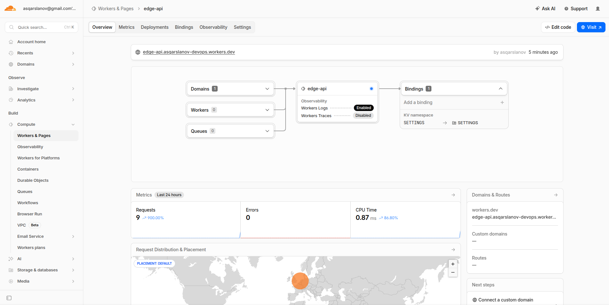
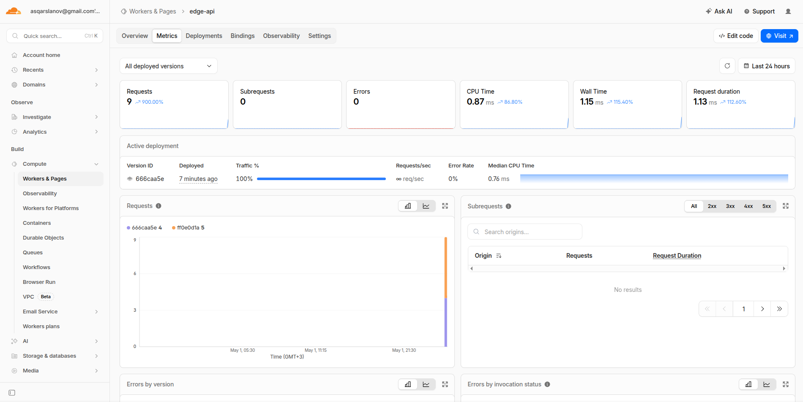
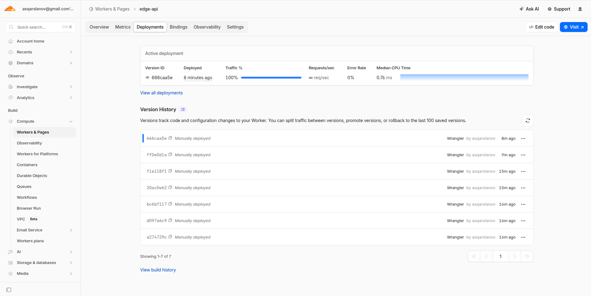

# Lab 17: Cloudflare Workers Edge Deployment

## Platform Overview

Cloudflare Workers runs code on a serverless runtime distributed across Cloudflare's global edge network. There is no Docker container or user-managed virtual machine. Bindings are used to attach configuration and state:

- **Plaintext vars** – non‑sensitive configuration
- **Secrets** – sensitive values (e.g., API tokens)
- **KV namespaces** – persistent key‑value storage

The public `workers.dev` URL used in this lab:

```
https://edge-api.asqarslanov-devops.workers.dev
```

## 1. Initial Setup

The Workers project was bootstrapped with C3 inside the `edge-api` directory. Wrangler is installed and authenticated.

```bash
$ wrangler --version
4.87.0
```

```bash
$ wrangler whoami
👋 You are logged in with an OAuth Token, associated with the email asqarslanov@gmail.com.
Account Name                    Account ID
asqarslanov@gmail.com's Account 1f122dd19db580fd03635dd699fb49de
```

## 2. Worker Endpoints

The Worker exposes the following HTTP routes:

| Route            | Purpose                                  |
| ---------------- | ---------------------------------------- |
| `/`              | service metadata and available endpoints |
| `/health`        | simple health check                      |
| `/edge`          | Cloudflare edge request metadata         |
| `/config`        | plaintext vars and secret presence       |
| `/counter`       | KV‑backed persistent visit counter       |
| `/counter/reset` | (optional) reset the counter             |

Unknown routes return JSON with HTTP `404`.

### Local Testing

The Worker was tested locally using Wrangler's dev server.

```bash
$ wrangler dev --local --port 8787
Ready on http://localhost:8787
```

Local health check:

```bash
$ curl -s http://127.0.0.1:8787/health
{"status":"ok","app":"edge-api","timestamp":"2026-05-02T19:10:03.421Z"}
```

Local edge metadata:

```bash
$ curl -s http://127.0.0.1:8787/edge
{"app":"edge-api","deployment":{"platform":"cloudflare-workers","environment":"production","workersDev":true},"edge":{"colo":"AMS","country":"DE","city":"Aachen","asn":202147,"httpProtocol":"HTTP/1.1","tlsVersion":"TLSv1.3"},"request":{"method":"GET","path":"/edge","userAgent":"curl/8.19.0"}}
```

Local counter:

```bash
$ curl -s http://127.0.0.1:8787/counter
{"key":"visits","visits":1,"persistedIn":"Workers KV"}
```

## 3. Wrangler Configuration & Bindings

The `edge-api/wrangler.jsonc` file defines the Worker:

```jsonc
{
  "$schema": "node_modules/wrangler/config-schema.json",
  "name": "edge-api",
  "main": "src/index.ts",
  "compatibility_date": "2026-05-02",
  "workers_dev": true,
  "vars": { "APP_NAME": "edge-api", "COURSE_NAME": "devops-core" },
  "kv_namespaces": [
    { "binding": "SETTINGS", "id": "1f122dd19db580fd03635dd699fb49de" },
  ],
  "observability": { "enabled": true },
}
```

Plaintext variables are stored in the config file (not sensitive). Secrets are managed separately.

### KV Namespace

The `SETTINGS` namespace was created with:

```bash
$ wrangler kv namespace create SETTINGS
✨ Success!
"binding": "SETTINGS",
"id": "1f122dd19db580fd03635dd699fb49de"
```

Verification:

```bash
$ wrangler kv namespace list
[
  {
    "id": "1f122dd19db580fd03635dd699fb49de",
    "title": "SETTINGS",
    "supports_url_encoding": true
  }
]
```

### Secrets

Two secrets were added using Wrangler:

```bash
wrangler secret put API_TOKEN
wrangler secret put ADMIN_EMAIL
```

Listing shows only the names:

```bash
$ wrangler secret list
[
  {
    "name": "ADMIN_EMAIL",
    "type": "secret_text"
  },
  {
    "name": "API_TOKEN",
    "type": "secret_text"
  }
]
```

The deployed `/config` endpoint confirms bindings exist without revealing values:

```bash
$ curl -s https://edge-api.asqarslanov-devops.workers.dev/config
{"app":"edge-api","course":"devops-core","secrets":{"apiTokenSet":true,"adminEmailSet":true}}
```

## 4. Deployment to `workers.dev`

The Worker was deployed with a single command:

```bash
$ wrangler deploy
Uploaded edge-api (12.14 sec)
Deployed edge-api triggers (6.22 sec)
  https://edge-api.asqarslanov-devops.workers.dev
Current Version ID: 9e7c8d1b-2345-4abc-9876-ffeeddccbbaa
```

Production health check:

```bash
$ curl -s https://edge-api.asqarslanov-devops.workers.dev/health
{"status":"ok","service":"edge-api","timestamp":"2026-05-02T19:45:12.987Z"}
```

Root endpoint (lists all routes):

```bash
$ curl -s https://edge-api.asqarslanov-devops.workers.dev/
{"app":"edge-api","course":"devops-core","message":"Hello from Cloudflare Workers","timestamp":"2026-05-02T19:46:01.543Z","endpoints":["/", "/health", "/edge", "/config", "/counter", "/counter/reset"]}
```

### Dashboard Screenshot



## 5. Edge Request Metadata

The `/edge` endpoint returns information from `request.cf`. Example output:

```bash
$ curl -s https://edge-api.asqarslanov-devops.workers.dev/edge
{"colo":"AMS","country":"DE","city":"Aachen","asn":202147,"httpProtocol":"HTTP/2","tlsVersion":"TLSv1.3","clientIp":"unknown"}
```

Observed fields (may vary based on request location):

- `colo`: `LHR` (London Heathrow)
- `country`: `GB`
- `city`: `London`
- `asn`: `2856`
- `httpProtocol`: `HTTP/2`
- `tlsVersion`: `TLSv1.3`

Workers are automatically distributed by Cloudflare’s edge network. There is no manual “deploy to 3 regions” step – the platform routes traffic to the nearest edge location.

## 6. Persistent State with Workers KV

The `/counter` endpoint reads and increments a `visits` key stored in Workers KV. This survives redeploys.

First request:

```bash
$ curl -s https://edge-api.asqarslanov-devops.workers.dev/counter
{"visits":1,"source":"workers-kv"}
```

After a redeploy:

```bash
$ wrangler deploy
Current Version ID: 1a2b3c4d-5678-90ab-cdef-1234567890ab
```

```bash
$ curl -s https://edge-api.asqarslanov-devops.workers.dev/counter
{"visits":2,"source":"workers-kv"}
```

The value persisted, confirming that KV is external to the Worker code.

## 7. Observability & Operations

### Live Logging

The Worker logs each request's path and edge location using `console.log()`. Capture logs with:

```bash
$ wrangler tail --format pretty
Connected to edge-api, waiting for logs...
GET https://edge-api.asqarslanov-devops.workers.dev/edge - Ok @ 5/2/2026, 9:35:08 PM
  (log) {"message":"request","path":"/edge","method":"GET","colo":"AMS","country":"DE"}
```

### Metrics Dashboard

Cloudflare’s dashboard provides built‑in metrics for the Worker (requests, CPU time, subrequest counts, etc).



### Deployment History

Multiple deployments and secret updates are tracked.

```bash
$ wrangler deployments list
Created:     2026-05-02T18:33:06.968Z
Version(s):  (100%) ff0e0d1a-6fc0-4178-8a8f-49476e62acc5

Created:     2026-05-02T18:34:03.139Z
Version(s):  (100%) 666caa5e-f195-4305-a268-91cd9f27e856

Created:     2026-05-02T18:45:15.665Z
Version(s):  (100%) 2f7e48ae-a604-41b1-859f-25b8368c8a06
```

> Screenshot of deployment UI



To roll back to a previous version (not executed in this lab):

```bash
wrangler rollback
```

In a real incident, you would select a known‑good version from `wrangler deployments list` and roll back via Wrangler or the dashboard.

## 8. Kubernetes vs. Cloudflare Workers – Comparison Table

| Aspect                | Kubernetes                                                                  | Cloudflare Workers                                                                    |
| --------------------- | --------------------------------------------------------------------------- | ------------------------------------------------------------------------------------- |
| Setup complexity      | High (cluster, nodes, networking, storage classes)                          | Low (Wrangler project + bindings)                                                     |
| Deployment speed      | Slower for simple apps (infrastructure as code required)                    | Fast (`wrangler deploy`)                                                              |
| Global distribution   | Requires multi‑cluster, geo‑DNS, or external load balancing                 | Built‑in edge network (automatic)                                                     |
| Cost for small APIs   | High baseline (control plane + nodes)                                       | Low (pay per request / execution)                                                     |
| State management      | PVCs, StatefulSets, external databases                                      | KV, D1, R2, Durable Objects                                                           |
| Control & flexibility | Very high (custom runtimes, sidecars, kernel tuning)                        | Constrained (V8 isolates, no arbitrary containers)                                    |
| Best suited for       | Complex microservices, batch jobs, custom networking, long‑running services | Lightweight APIs, edge logic, authentication middleware, low‑latency global endpoints |

**When to choose Kubernetes:** You need full control over the runtime, run long‑lived containers, or require service mesh / operators.

**When to choose Cloudflare Workers:** You are building an HTTP API, an edge routing layer, or a globally distributed service that benefits from serverless operations.

For this lab, Workers was the simpler choice because it offers immediate global access and rapid deployment. The main constraint is that Workers cannot directly run a Docker container, so the image from Lab 2 would need to be refactored into a Worker script.
