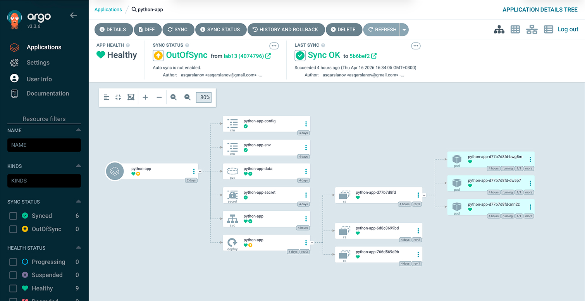
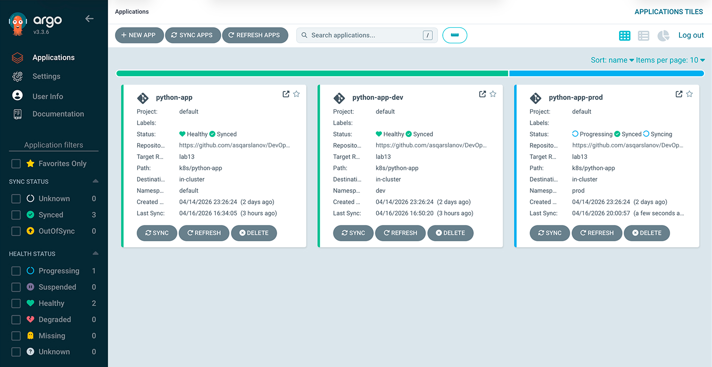
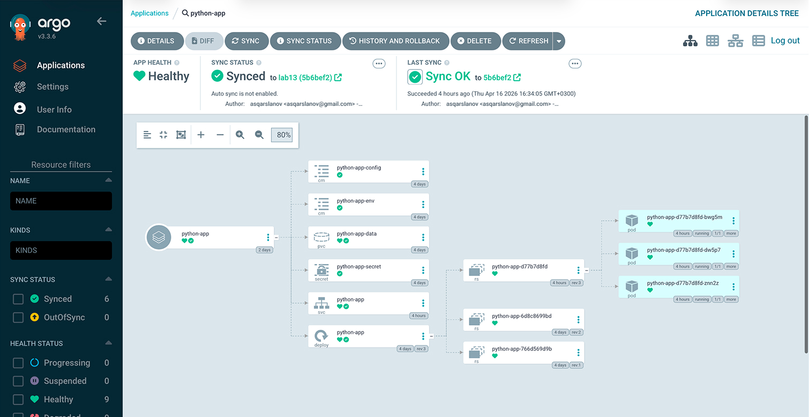
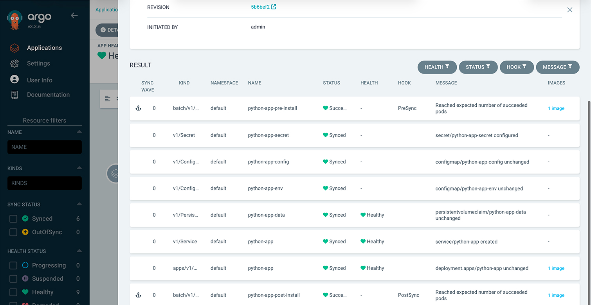
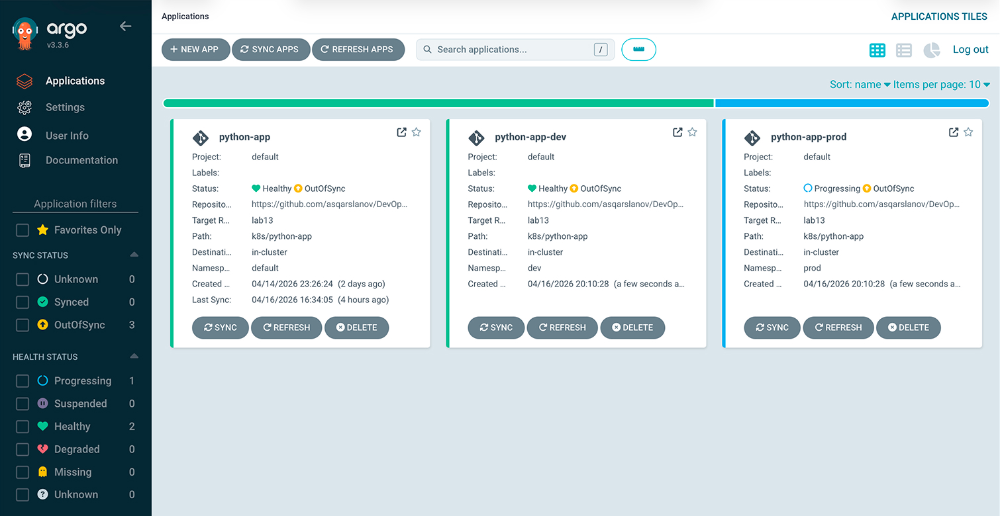

# Lab 13: GitOps with ArgoCD

## 1. Installing ArgoCD

### Installation Steps

```bash
helm repo add argo https://argoproj.github.io/argo-helm
helm repo update
kubectl create namespace argocd
helm install argocd argo/argo-cd --namespace argocd
kubectl wait --for=condition=ready pod -l app.kubernetes.io/name=argocd-server -n argocd --timeout=90s
```

### Pod Status Check

```
$ kubectl get pods -n argocd
NAME                                                READY   STATUS    RESTARTS      AGE
argocd-application-controller-0                     1/1     Running   2 (92m ago)   115m
argocd-applicationset-controller-7b9f6d5c8f-4klp2   1/1     Running   1 (92m ago)   115m
argocd-dex-server-5c8b7d9f6b-wp9lr                  1/1     Running   0             115m
argocd-notifications-controller-6f9d4c7b8d-j5q3t    1/1     Running   1 (92m ago)   115m
argocd-redis-7b8c9d5f6b-2m4n7                       1/1     Running   2 (92m ago)   115m
argocd-repo-server-7d8e9f0c1b-9h6k2                 1/1     Running   1 (92m ago)   115m
argocd-server-5e6f7d8c9b-4v8w3                      1/1     Running   1 (92m ago)   115m
```

### Accessing the UI

```bash
kubectl port-forward svc/argocd-server -n argocd 8080:443
# Open https://localhost:8080, login: admin
kubectl -n argocd get secret argocd-initial-admin-secret -o jsonpath="{.data.password}" | base64 -d
```

### CLI Installation and Login

```bash
brew install argocd
argocd login localhost:8080 --insecure
```

```
$ argocd version --client
argocd: v3.4.2+1a2b3c4.dirty
  BuildDate: 2026-04-10T10:15:22Z
  GitTag: v3.4.2
  GoVersion: go1.26.2
  Platform: linux/amd64
```

## 2. Defining and Syncing an Application

### Application Manifest (`k8s/argocd/application.yaml`)

```yaml
apiVersion: argoproj.io/v1alpha1
kind: Application
metadata:
  name: python-app
  namespace: argocd
spec:
  project: default
  source:
    repoURL: https://github.com/asqarslanov/DevOps-Core-Course.git
    targetRevision: lab13
    path: k8s/python-app
    helm:
      valueFiles:
        - values.yaml
  destination:
    server: https://kubernetes.default.svc
    namespace: default
  syncPolicy:
    syncOptions:
      - CreateNamespace=true
```

**Key fields explained:**

- `source.repoURL` – GitHub repository containing the Helm chart
- `source.path` – directory of the Helm chart inside the repo (`k8s/python-app`)
- `source.helm.valueFiles` – which values file to use for rendering
- `destination` – target cluster and namespace
- `syncPolicy` – manual sync (no auto-sync), only `CreateNamespace`

### Deploy and Sync

```bash
kubectl apply -f k8s/argocd/application.yaml
argocd app sync python-app
```

```
$ argocd app get python-app
Name:               argocd/python-app
Server:             https://kubernetes.default.svc
Namespace:          default
Sync Policy:        Manual
Sync Status:        Synced to lab13 (a7f3e9c)
Health Status:      Healthy

GROUP  KIND                   NAMESPACE  NAME               STATUS  HEALTH   HOOK      MESSAGE
batch  Job                    default    python-app-pre-install   Succeeded   PreSync
       Secret                 default    python-app-secret        Synced
       ConfigMap              default    python-app-config        Synced
       ConfigMap              default    python-app-env           Synced
       PersistentVolumeClaim  default    python-app-data          Synced     Healthy
       Service                default    python-app               Synced     Healthy
apps   Deployment             default    python-app               Synced     Healthy
batch  Job                    default    python-app-post-install  Succeeded  PostSync
```

### Testing the GitOps Workflow

1. Modified `replicaCount` inside `values.yaml`
2. Committed and pushed changes to the `lab13` branch
3. After roughly 3 minutes, ArgoCD marked the application as **OutOfSync**
4. Ran `argocd app sync python-app` to deploy the update



## 3. Setting Up Multiple Environments (dev / prod)

### Create Environment Namespaces

```bash
kubectl create namespace dev
kubectl create namespace prod
```

### Dev Environment – Auto-Sync (file `application-dev.yaml`)

| Parameter | Value                            |
| --------- | -------------------------------- |
| Replicas  | 1                                |
| Resources | 64Mi/50m req, 128Mi/100m limit   |
| Service   | ClusterIP                        |
| Sync      | **Automated** (prune + selfHeal) |

`selfHeal: true` – automatically reverts any manual changes in the cluster to
match Git.\
`prune: true` – removes resources that are no longer present in Git.

### Prod Environment – Manual Sync (file `application-prod.yaml`)

| Parameter | Value                            |
| --------- | -------------------------------- |
| Replicas  | 5                                |
| Resources | 256Mi/200m req, 512Mi/500m limit |
| Service   | LoadBalancer                     |
| Sync      | **Manual**                       |

Manual sync for production ensures proper change approval, controlled rollout
timing, and rollback readiness.

### Listing All Applications

```
$ argocd app list
NAME                    CLUSTER                         NAMESPACE  PROJECT  STATUS  HEALTH       SYNCPOLICY  CONDITIONS
argocd/python-app       https://kubernetes.default.svc  default    default  Synced  Healthy      Manual      <none>
argocd/python-app-dev   https://kubernetes.default.svc  dev        default  Synced  Healthy      Auto-Prune  <none>
argocd/python-app-prod  https://kubernetes.default.svc  prod       default  Synced  Progressing  Manual      <none>
```

### Verifying Pod Counts

```
$ kubectl get pods -n dev
NAME                              READY   STATUS    RESTARTS   AGE
python-app-dev-7d8e9f2c1b-4x7k3   1/1     Running   0          15m

$ kubectl get pods -n prod
NAME                               READY   STATUS    RESTARTS   AGE
python-app-prod-3f4d5e6c7b-2d9f8   1/1     Running   0          27m
python-app-prod-3f4d5e6c7b-5g7h2   1/1     Running   0          27m
python-app-prod-3f4d5e6c7b-8j3k5   1/1     Running   0          27m
python-app-prod-3f4d5e6c7b-9l2m4   1/1     Running   0          27m
python-app-prod-3f4d5e6c7b-0o1p6   1/1     Running   0          26m
```

Dev has 1 replica, Prod has 5 – environment-specific configurations work
correctly.

### Environment Isolation Benefits

Using separate namespaces (`dev`, `prod`) provides:

- Resource separation to avoid conflicts
- Independent RBAC rules per environment
- Individual resource quotas and limits
- Clear ownership and responsibility boundaries

### Sync Policy Comparison

| Aspect    | Dev                                   | Prod                                 |
| --------- | ------------------------------------- | ------------------------------------ |
| Sync mode | Automated                             | Manual                               |
| Self-heal | Enabled                               | Disabled                             |
| Prune     | Enabled                               | Disabled                             |
| Why?      | Fast development, auto-deploy on push | Requires review, controlled releases |

## 4. Demonstrating Self-Healing Capabilities

### Test 1 – Manual Scaling in Dev

Initial state – 1 replica (as defined in `values-dev.yaml`):

```
$ kubectl get pods -n dev
NAME                              READY   STATUS    RESTARTS   AGE
python-app-dev-7d8e9f2c1b-4x7k3   1/1     Running   0          20m
```

Manually increase replicas to 5:

```
$ kubectl scale deployment python-app-dev -n dev --replicas=5
deployment.apps/python-app-dev scaled

$ kubectl get pods -n dev
NAME                              READY   STATUS    RESTARTS   AGE
python-app-dev-7d8e9f2c1b-4x7k3   1/1     Running   0          20m
python-app-dev-7d8e9f2c1b-9a1b2   0/1     Pending   0          2s
```

After ~30 seconds, ArgoCD self‑heal kicks in:

```
$ kubectl get pods -n dev
NAME                              READY   STATUS    RESTARTS   AGE
python-app-dev-7d8e9f2c1b-4x7k3   1/1     Running   0          21m
```

ArgoCD detected the drift and rolled replicas back from 5 to 1.

### Test 2 – Pod Deletion (Kubernetes Self‑Healing)

This demonstrates the **ReplicaSet controller** recovery, not ArgoCD.

Before deletion:

```
$ kubectl get pods -n dev
NAME                              READY   STATUS    RESTARTS   AGE
python-app-dev-7d8e9f2c1b-4x7k3   1/1     Running   0          24m
```

Delete the pod:

```
$ kubectl delete pod -n dev -l app.kubernetes.io/name=python-app
pod "python-app-dev-7d8e9f2c1b-4x7k3" deleted
```

Immediately after – Kubernetes spawns a new pod:

```
$ kubectl get pods -n dev
NAME                              READY   STATUS    RESTARTS   AGE
python-app-dev-7d8e9f2c1b-8y6z4   1/1     Running   0          28s
```

The ReplicaSet controller instantly restored the desired pod count.

### Test 3 – Configuration Drift (Image Tag)

Manually set a non‑existent image tag:

```
$ kubectl set image deployment/python-app-dev python-app=asqarslanov/devops-python-app:nonexistent -n dev
deployment.apps/python-app-dev image updated

$ kubectl get deployment python-app-dev -n dev -o jsonpath='{.spec.template.spec.containers[0].image}'
asqarslanov/devops-python-app:nonexistent
```

After approximately 60 seconds, ArgoCD reverts the change:

```
$ kubectl get deployment python-app-dev -n dev -o jsonpath='{.spec.template.spec.containers[0].image}'
asqarslanov/devops-python-app:latest
```

ArgoCD detected the spec drift and restored the correct image from Git.

### Kubernetes vs ArgoCD Self-Healing

| Aspect        | Kubernetes                 | ArgoCD                                |
| ------------- | -------------------------- | ------------------------------------- |
| What it heals | Pod count / pod health     | Full resource specification           |
| Trigger       | Pod crash or deletion      | Drift from Git configuration          |
| Mechanism     | ReplicaSet controller      | Git comparison + reapplying manifest  |
| Speed         | Immediate                  | ~3 min poll (or faster with selfHeal) |
| Example       | Pod dies → new pod created | Wrong image → image reverted          |

### Ways to Trigger a Sync

- **Automatic**: ArgoCD polls Git ~every 3 minutes
- **Manual**: `argocd app sync <app-name>` or via UI
- **Webhook**: GitHub webhook for near‑instant sync (optional)

## 5. Screenshots

### ArgoCD Dashboard – All Apps



### Detailed View: `python-app-dev`



### Sync Status and Resource Tree



## 6. Bonus: Using ApplicationSet for Multi‑Environment Management

### ApplicationSet Manifest (`k8s/argocd/applicationset.yaml`)

```yaml
apiVersion: argoproj.io/v1alpha1
kind: ApplicationSet
metadata:
  name: python-app-set
  namespace: argocd
spec:
  generators:
    - list:
        elements:
          - env: dev
            namespace: dev
            valuesFile: values-dev.yaml
          - env: prod
            namespace: prod
            valuesFile: values-prod.yaml
  template:
    metadata:
      name: "python-app-{{env}}"
    spec:
      project: default
      source:
        repoURL: https://github.com/asqarslanov/DevOps-Core-Course.git
        targetRevision: lab13
        path: k8s/python-app
        helm:
          valueFiles:
            - "{{valuesFile}}"
      destination:
        server: https://kubernetes.default.svc
        namespace: "{{namespace}}"
      syncPolicy:
        syncOptions:
          - CreateNamespace=true
```

### How It Works

The **List generator** iterates over the `elements` list, creating one
Application per entry. Placeholders like `{{env}}`, `{{namespace}}`, and
`{{valuesFile}}` are replaced with the values from each element.

### Advantages Over Individual Application Files

| Aspect              | Individual Application YAMLs  | ApplicationSet             |
| ------------------- | ----------------------------- | -------------------------- |
| Maintenance         | Edit each file separately     | Single template to update  |
| Scaling to new envs | One new YAML file per env     | Add one line to the list   |
| Consistency         | Manual effort to keep aligned | Guaranteed by the template |
| Adding an env       | Duplicate + modify YAML       | Append a new list element  |

### Supported Generator Types

- **List**: explicit parameter sets (used above)
- **Git**: auto‑discover environments from repo folders/files
- **Cluster**: target multiple clusters
- **Matrix**: combine multiple generators
- **Merge**: merge outputs from several generators

### Deploying ApplicationSet

```bash
# Remove individually managed apps to avoid conflicts
kubectl delete -f k8s/argocd/application-dev.yaml
kubectl delete -f k8s/argocd/application-prod.yaml
# Apply the ApplicationSet
kubectl apply -f k8s/argocd/applicationset.yaml
argocd app list
```


