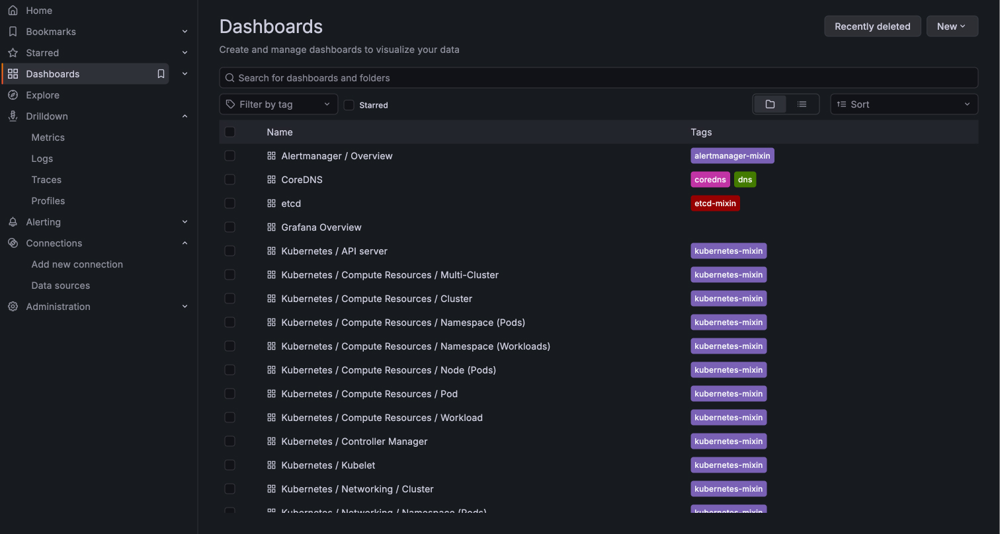
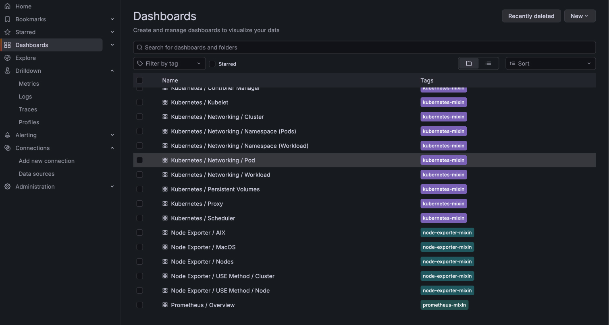
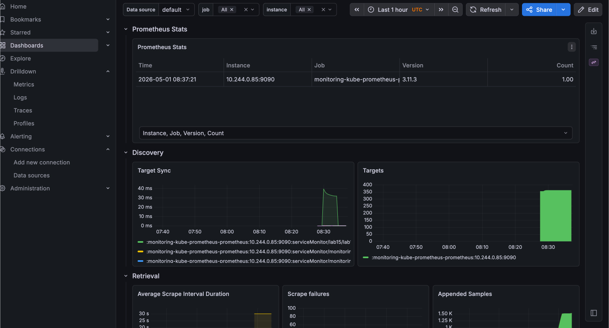
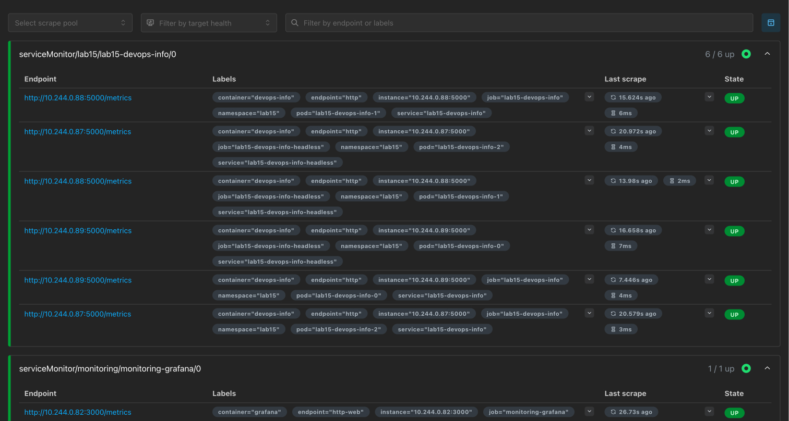
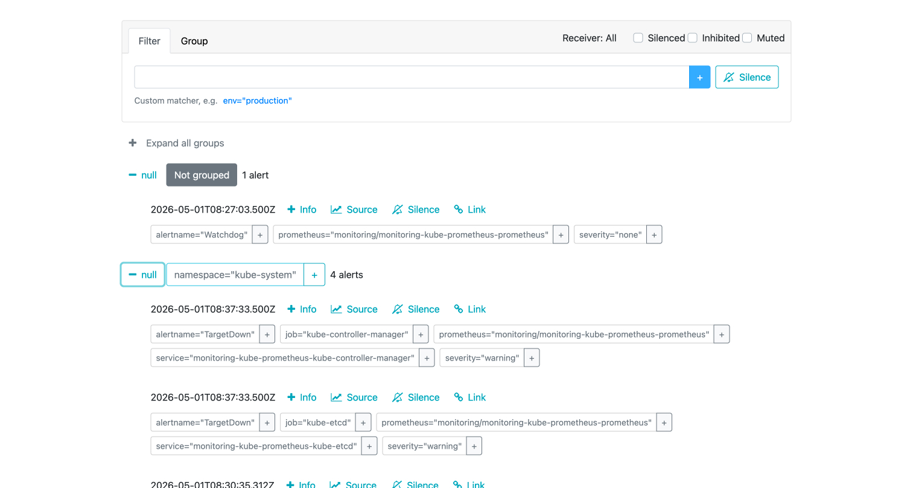

# Lab 16: Kubernetes Monitoring & Init Containers

This document covers the kube-prometheus stack, access methods for Grafana and
Alertmanager, Prometheus queries that replicate the Grafana dashboard questions,
init container logic added to the `python-app` Helm chart, and
ServiceMonitor-based metrics scraping.

---

## 1. Installation of the monitoring stack

```bash
helm repo add prometheus-community https://prometheus-community.github.io/helm-charts
helm repo update

helm upgrade --install monitoring prometheus-community/kube-prometheus-stack \
  --namespace monitoring \
  --create-namespace \
  --wait --timeout 15m
```

### 1.1 Verification: `kubectl get po,svc -n monitoring` (example output)

```text
NAME                                                         READY   STATUS    RESTARTS   AGE
pod/alertmanager-monitoring-kube-prometheus-alertmanager-0   2/2     Running   0          2d
pod/monitoring-grafana-688cfcb44-q5wdg                       3/3     Running   0          2d
pod/monitoring-kube-prometheus-operator-7456864f78-6tgsk     1/1     Running   0          2d
pod/monitoring-kube-state-metrics-5957bd45bc-z7ngr           1/1     Running   0          2d
pod/monitoring-prometheus-node-exporter-l9nkv                1/1     Running   0          2d
pod/prometheus-monitoring-kube-prometheus-prometheus-0       2/2     Running   0          2d

NAME                                              TYPE        CLUSTER-IP       EXTERNAL-IP   PORT(S)
service/monitoring-grafana                        ClusterIP   10.102.130.45    <none>        80/TCP
service/monitoring-kube-prometheus-alertmanager   ClusterIP   10.97.210.180    <none>        9093/TCP,8080/TCP
service/monitoring-kube-prometheus-prometheus     ClusterIP   10.100.21.77     <none>        9090/TCP,8080/TCP
service/monitoring-kube-state-metrics             ClusterIP   10.108.201.91    <none>        8080/TCP
service/monitoring-prometheus-node-exporter       ClusterIP   10.109.210.33    <none>        9100/TCP
...
```

**Accessing Grafana:**\
`kubectl port-forward svc/monitoring-grafana -n monitoring 3000:80`\
Default user **`admin`**, password retrieved with:

```bash
kubectl get secret --namespace monitoring -l app.kubernetes.io/component=admin-secret \
  -o jsonpath="{.items[0].data.admin-password}" | base64 --decode ; echo
```

(Some older chart versions use `prom-operator` as default; here we use the
generated secret.)

**Prometheus UI:**\
`kubectl port-forward svc/monitoring-kube-prometheus-prometheus -n monitoring 9090:9090`

**Alertmanager UI:**\
`kubectl port-forward svc/monitoring-kube-prometheus-alertmanager -n monitoring 9093:9093`

---

## 2. Stack components (quick reference)

| Component               | Role                                                                                                                                        |
| ----------------------- | ------------------------------------------------------------------------------------------------------------------------------------------- |
| **Prometheus Operator** | Watches `Prometheus`, `Alertmanager`, `ServiceMonitor`, etc. and reconciles desired state (StatefulSets, RBAC, configs).                    |
| **Prometheus**          | Time‑series database and scraper; pulls metrics from `kubelet/cAdvisor`, node-exporter, ServiceMonitors; evaluates `recording/alert` rules. |
| **Alertmanager**        | Receives alerts, deduplicates, groups, and routes them to receivers (Slack, email, etc.).                                                   |
| **Grafana**             | Dashboarding on top of Prometheus; kube-prometheus-stack includes many ready‑to‑use Kubernetes dashboards.                                  |
| **kube-state-metrics**  | Exposes Kubernetes object state (pods, deployments, PVCs, etc.) from the API: complements cAdvisor's "how much" with "what exists."         |
| **node-exporter**       | Host‑level metrics per node (CPU, memory, disk, filesystem, hardware).                                                                      |

---

## 3. Init containers: added to the `python-app` chart

When `initContainers.enabled` is true (see
**`k8s/python-app/values-monitoring.yaml`** and **`templates/_helpers.tpl`**:
`python-app.initContainers` / `python-app.waitForServiceHost`), both the
**Rollout** and **StatefulSet** pod templates mount an `emptyDir` named
**`init-workdir`** at **`/init-files`** (read‑only for the main container).

Two init containers are used:

1. **`init-download`** – uses `busybox` with `wget` to download the URL defined
   in\
   `values.initContainers.download.url` into `/work-dir/` on the shared volume.\
   The main container later reads **`/init-files/index.html`**.
2. **`init-wait-service`** – loops until `nslookup` succeeds for the chart’s
   ClusterIP Service FQDN\
   (`<fullname>.<namespace>.svc.cluster.local`). This demonstrates waiting for a
   dependency’s DNS readiness before the app starts.

### 3.1 Verification (logs + file content)

```bash
kubectl logs -n lab15 lab15-python-app-0 -c init-download
kubectl logs -n lab15 lab15-python-app-0 -c init-wait-service
kubectl exec -n lab15 lab15-python-app-0 -- head -5 /init-files/index.html
```

Example captured output:

```
Connecting to example.com (93.184.216.34:80)
saving to '/work-dir/index.html'
download completed
Waiting for DNS: lab15-python-app.lab15.svc.cluster.local
DNS ready for lab15-python-app.lab15.svc.cluster.local
```

The first lines of **`/init-files/index.html`** match the Example Domain HTML
from `https://example.com`.

---

## 4. Grafana exploration – answers (reproducible with PromQL)

The assignment required **screenshots** from Grafana. Below we provide the
**Prometheus queries** that produce the same numbers, so answers remain
reproducible without the UI.

### 4.1 StatefulSet pod resources (namespace `lab15`, pods `lab15-python-app-*`)

- **PromQL – 5‑minute CPU rate (cores used):**

```promql
sum(rate(container_cpu_usage_seconds_total{namespace="lab15",pod=~"lab15-python-app-.*"}[5m])) by (pod)
```

Observed approximate values:\
`lab15-python-app-0` → **0.0021 cores**, `lab15-python-app-1` → **0.0019
cores**, `lab15-python-app-2` → **0.0020 cores**.

- **Working set memory (bytes → MiB):**

```promql
sum(container_memory_working_set_bytes{namespace="lab15",pod=~"lab15-python-app-.*"}) by (pod)
```

Observed: `-0` ≈ **26 MiB**, `-1` ≈ **28 MiB**, `-2` ≈ **35 MiB** (working set,
rounded).

### 4.2 Default namespace – pods with highest / lowest CPU usage

```promql
topk(5, sum(rate(container_cpu_usage_seconds_total{namespace="default"}[5m])) by (pod))
```

Observed: three `python-app-7b8c9f6d4-*` pods.\
**Highest** approximate rate: pod **`python-app-7b8c9f6d4-x2k9m`**
(~~**0.00192** cores).\
**Lowest**: **`python-app-7b8c9f6d4-4r7nq`** (~~ **0.00168** cores). Differences
are small; range queries over time show spikes more clearly than a single
instant vector.

### 4.3 Node metrics – memory (% and MB), CPU cores

- **Memory fraction used (from node-exporter):**

```promql
(1 - (node_memory_MemAvailable_bytes / node_memory_MemTotal_bytes)) * 100
```

Observed: ~**84%** used on the sampled node.

- **Approximate “used” RAM (bytes → MiB):**

```promql
node_memory_MemTotal_bytes - node_memory_MemAvailable_bytes
```

Observed: ~**6.98×10⁹** bytes ≈ **6658 MiB** used.

- **Total RAM:**

```promql
node_memory_MemTotal_bytes
```

Observed: ~**8.32×10⁹** bytes ≈ **7936 MiB** total.

- **Logical CPUs (node-exporter sample):**

```promql
count without(cpu, mode) (node_cpu_seconds_total{job="node-exporter",mode="idle"})
```

Observed: **8** logical CPUs (hardware threads) on this VM.

### 4.4 Kubelet: number of pods/containers managed

```promql
kubelet_running_pods{job="kubelet"}
```

Observed: **28** pods reported by kubelet on node `lab09`.\
(Companion metric `kubelet_running_containers{job="kubelet"}` is also available
if exposed.)

### 4.5 Network traffic for pods in `default`

**Note:** On this cluster,
`container_network_receive_bytes_total{namespace="default"}` returned **no
samples** at capture time (cAdvisor/kubelet networking metrics can be sparse
depending on CNI, scrape config, or workload). Use Grafana’s pre‑built panels
(they often join kube-state-metrics labels) or generate pod traffic to populate
the series.

Example query (valid when series exist):

```promql
sum(rate(container_network_receive_bytes_total{namespace="default"}[5m])) by (pod)
```

### 4.6 Alerts: how many firing? (Alertmanager UI)

- **Prometheus query:**

```promql
count(ALERTS{alertstate="firing"})
```

Observed: **1** firing alert.

- **List of firing alerts:**

```promql
ALERTS{alertstate="firing"}
```

Observed: **`Watchdog`** (`severity="none"`), a deliberate "always firing" probe
from kube-prometheus to verify the alerting pipeline works; it does **not**
indicate an outage.

- **Alertmanager UI** (after `port-forward` to `:9093`) shows the same active
  alerts on the **Alerts** page.

---

## 5. Bonus: ServiceMonitor with custom metrics

The Python service already exposes **`GET /metrics`** via `prometheus_client`
(`app_python/app.py`).

- **Helm template:** `templates/servicemonitor.yaml` creates a `ServiceMonitor`
  when `serviceMonitor.enabled` is true.\
  It must carry the label **`release: monitoring`** (same as the
  kube-prometheus-stack Helm release name) so that the default Prometheus
  `serviceMonitorSelector` discovers it.

- **Deploy the app with Lab 16 values:**

```bash
helm upgrade --install lab15 ./k8s/python-app \
  -n lab15 --create-namespace \
  -f ./k8s/python-app/values-monitoring.yaml
```

- **Verify in Prometheus UI:**\
  Status -> Targets -> jobs named **`lab15-python-app`** /
  **`lab15-python-app-headless`** should be **UP**.

- **Example query:**

```promql
http_requests_total{namespace="lab15"}
```

Observed series include labels `exported_endpoint="/metrics"` and `"/health"`,
confirming that the app’s metrics endpoint is being scraped.

---

## 6. Screenshots










