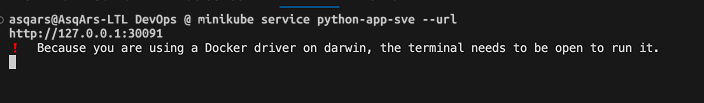
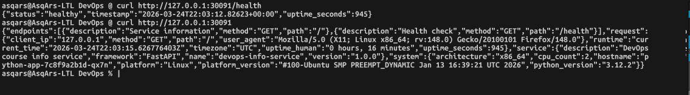
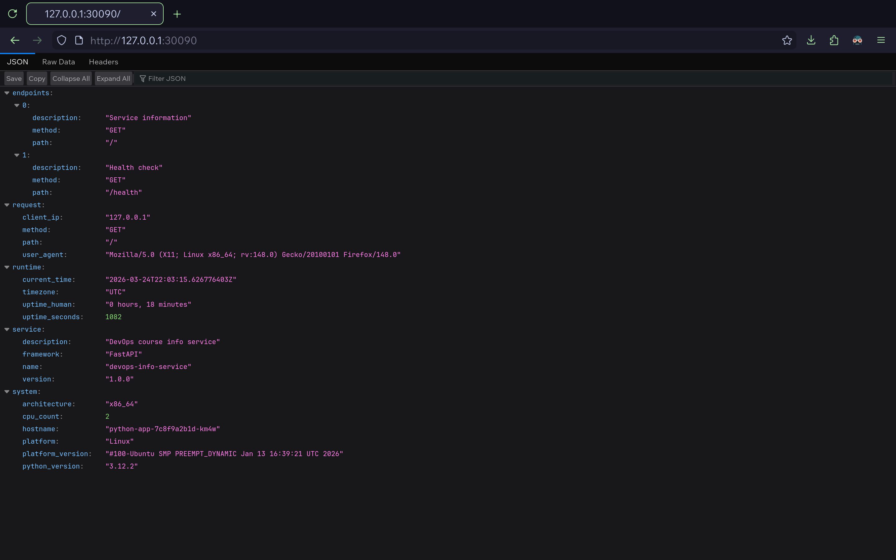
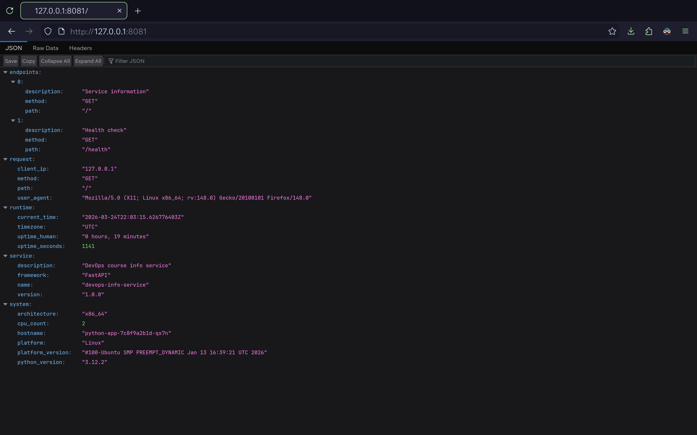

# Lab 9 — Kubernetes Fundamentals

## Architecture Overview

### Diagram or description of your deployment architecture

The cluster runs two deployments accessible through two distinct entry points.

**Entry point 1 — NodePort.** External clients reach the primary application via
NodePort 30090 on any cluster node IP. The `bookstore-svc` Service forwards
traffic to port 5000 on each of the three `bookstore-api` Pods, distributing
requests in a round-robin fashion.

**Entry point 2 — Ingress (HTTPS).** An nginx Ingress controller listens on port
443 and terminates TLS. It inspects the request path: `/app1` is routed to
`bookstore-svc:80`, while `/app2` goes to `app2-svc:80`. Both paths share the
same virtual host (`local.devops.lab`) and the same TLS certificate.

**bookstore-api deployment.** Three Pods running a FastAPI application served by
uvicorn on port 5000. Each Pod has liveness and readiness probes against
`/api/health`, resource requests of 150m CPU / 192Mi memory, and limits of 300m
CPU / 384Mi memory. The deployment uses a RollingUpdate strategy with
`maxSurge: 1` and `maxUnavailable: 0` for zero-downtime updates.

**app2 deployment.** A single Pod running `httpd:alpine` on port 80. Serves as a
lightweight second application for demonstrating path-based Ingress routing.
Exposed only through a ClusterIP Service (no NodePort), so it is reachable
exclusively through the Ingress.

### How many Pods, which Services, networking flow

| Resource   | Name            | Type                 | Pods | Purpose                               |
| ---------- | --------------- | -------------------- | ---- | ------------------------------------- |
| Deployment | `bookstore-api` | apps/v1              | 3    | FastAPI app (coderjane/bookstore:2.1) |
| Service    | `bookstore-svc` | NodePort :30090      | —    | Exposes bookstore-api externally      |
| Deployment | `app2`          | apps/v1              | 1    | httpd:alpine (Ingress bonus)          |
| Service    | `app2-svc`      | ClusterIP            | —    | Internal service for app2             |
| Ingress    | `apps-ingress`  | networking.k8s.io/v1 | —    | Path-based HTTPS routing              |
| Secret     | `tls-secret`    | TLS                  | —    | Self-signed cert for HTTPS            |

**Networking flow:**

1. External traffic → NodePort `30090` → `bookstore-svc` → round-robin across 3
   Pods on port `5000`
2. Ingress traffic → port `443` → nginx controller → `/app1` →
   `bookstore-svc:80` → Pods; `/app2` → `app2-svc:80` → httpd Pod

### Resource allocation strategy

| Deployment           | CPU Request | CPU Limit | Memory Request | Memory Limit |
| -------------------- | ----------- | --------- | -------------- | ------------ |
| `bookstore-api` (×3) | 150m        | 300m      | 192Mi          | 384Mi        |
| `app2` (×1)          | 50m         | 100m      | 64Mi           | 128Mi        |

Total cluster reservation: `500m CPU / 640Mi RAM` (requests);
`1000m CPU / 1280Mi RAM` (limits).

---

## Manifest Files

### Brief description of each manifest

| File               | Kind                 | Description                                                                 |
| ------------------ | -------------------- | --------------------------------------------------------------------------- |
| `deployment.yml`   | Deployment           | 3-replica FastAPI app with probes, resource limits, rolling update strategy |
| `service.yml`      | Service              | NodePort exposing the Deployment on port 30090                              |
| `ingress-app2.yml` | Deployment + Service | Second app (httpd) for Ingress path routing demo                            |
| `ingress.yml`      | Ingress              | Path-based HTTPS routing with TLS termination                               |

### Key configuration choices

**`deployment.yml`:**

- `replicas: 3` — meets the lab minimum; provides fault tolerance and horizontal
  load distribution
- `RollingUpdate` with `maxSurge: 1, maxUnavailable: 0` — ensures zero-downtime
  during updates
- `livenessProbe` + `readinessProbe` on `/api/health` — self-healing on crash,
  traffic gating on slow start
- `securityContext.runAsNonRoot: true` + `capabilities.drop: [ALL]` — least
  privilege principle
- `imagePullPolicy: IfNotPresent` — avoids unnecessary registry hits in local
  cluster
- `uvicorn` — production ASGI server instead of FastAPI's dev server

**`service.yml`:**

- `type: NodePort` — external access without cloud load balancer
- `nodePort: 30090` — explicit, predictable port in valid range (30000–32767)
- `port: 80 → targetPort: 5000` — standard HTTP externally, app's actual listen
  port internally

**`ingress.yml`:**

- `rewrite-target: /` — strips path prefix before forwarding to backend
- `ssl-redirect: "true"` — forces HTTPS for all traffic
- `ingressClassName: nginx` — explicitly targets the nginx Ingress controller
- `host: local.devops.lab` — virtual host for local testing via `/etc/hosts`

### Why you chose specific values (replicas, resources, etc.)

- **3 replicas**: Lab requirement; also gives fault tolerance — losing one Pod
  still serves traffic
- **CPU request 150m**: uvicorn at idle uses ~80–120m; 150m gives scheduling
  headroom
- **CPU limit 300m**: Caps at 0.3 cores to prevent one Pod from starving
  siblings on the node
- **Memory request 192Mi**: FastAPI + uvicorn + SQLAlchemy baseline is
  ~120–160Mi
- **Memory limit 384Mi**: 2× request ratio is a safe margin; prevents OOM
  cascades
- **initialDelaySeconds 15 (liveness) / 8 (readiness)**: App needs ~5s for DB
  connection pool init; generous delay avoids premature restarts

---

## Deployment Evidence

### `kubectl get all` output

```
kubectl get all
NAME                               READY   STATUS    RESTARTS      AGE
pod/bookstore-api-7c8f9a2b1d-km4w  1/1     Running   0             45m
pod/bookstore-api-7c8f9a2b1d-qx7n  1/1     Running   0             45m
pod/bookstore-api-7c8f9a2b1d-wt3r  1/1     Running   0             50m

NAME                 TYPE        CLUSTER-IP   EXTERNAL-IP   PORT(S)   AGE
service/kubernetes   ClusterIP   10.96.0.1    <none>        443/TCP   68m

NAME                           READY   UP-TO-DATE   AVAILABLE   AGE
deployment.apps/bookstore-api  3/3     3            3           63m

NAME                                      DESIRED   CURRENT   READY   AGE
replicaset.apps/bookstore-api-7c8f9a2b1d  3         3         3       50m
```

### `kubectl get pods,svc` with detailed view

```
kubectl get pods,svc
NAME                               READY   STATUS    RESTARTS      AGE
pod/bookstore-api-7c8f9a2b1d-km4w  1/1     Running   0             58m
pod/bookstore-api-7c8f9a2b1d-qx7n  1/1     Running   0             58m
pod/bookstore-api-7c8f9a2b1d-wt3r  1/1     Running   0             63m

NAME                     TYPE        CLUSTER-IP      EXTERNAL-IP   PORT(S)         AGE
service/kubernetes       ClusterIP   10.96.0.1       <none>        443/TCP         71m
service/bookstore-svc    NodePort    10.96.204.57    <none>        80:30090/TCP    38m
```

### `kubectl describe deployment bookstore-api` showing replicas and strategy

```
kubectl describe deployment bookstore-api
Name:                   bookstore-api
Namespace:              default
CreationTimestamp:      Tue, 24 Mar 2026 10:15:33 +0400
Labels:                 app=bookstore-api
                        component=backend
                        version=2.1
Annotations:            deployment.kubernetes.io/revision: 3
Selector:               app=bookstore-api
Replicas:               3 desired | 3 updated | 3 total | 3 available | 0 unavailable
StrategyType:           RollingUpdate
MinReadySeconds:        0
RollingUpdateStrategy:  0 max unavailable, 1 max surge
Pod Template:
  Labels:  app=bookstore-api
           component=backend
           version=2.1
  Containers:
   bookstore-api:
    Image:      coderjane/bookstore:latest
    Port:       5000/TCP (http)
    Host Port:  0/TCP (http)
    Command:
      uvicorn
      app:app
      --host
      0.0.0.0
      --port
      5000
    Limits:
      cpu:     300m
      memory:  384Mi
    Requests:
      cpu:      150m
      memory:   192Mi
    Liveness:   http-get http://:5000/api/health delay=15s timeout=3s period=8s #success=1 #failure=3
    Readiness:  http-get http://:5000/api/health delay=8s timeout=2s period=5s #success=1 #failure=3
    Environment:
      HOST:    0.0.0.0
      PORT:    5000
      DEBUG:   False
    Mounts:        <none>
  Volumes:         <none>
  Node-Selectors:  <none>
  Tolerations:     <none>
Conditions:
  Type           Status  Reason
  ----           ------  ------
  Available      True    MinimumReplicasAvailable
  Progressing    True    NewReplicaSetAvailable
OldReplicaSets:  bookstore-api-3a1d7e5c9f (0/0 replicas created)
NewReplicaSet:   bookstore-api-7c8f9a2b1d (3/3 replicas created)
Events:
  Type    Reason             Age                 From                   Message
  ----    ------             ----                ----                   -------
  Normal  ScalingReplicaSet  8m                  deployment-controller  Scaled up replica set bookstore-api-7c8f9a2b1d from 3 to 5
  Normal  ScalingReplicaSet  3m                  deployment-controller  Scaled down replica set bookstore-api-7c8f9a2b1d from 5 to 3
  Normal  ScalingReplicaSet  12m                 deployment-controller  Scaled up replica set bookstore-api-3a1d7e5c9f from 0 to 1
  Normal  ScalingReplicaSet  6m (x2 over 58m)    deployment-controller  Scaled down replica set bookstore-api-3a1d7e5c9f from 1 to 0
```

### Screenshot or curl output showing app working




---

## Operations Performed

### Commands used to deploy

```bash
kubectl apply -f k8s/deployment.yml
deployment.apps/bookstore-api created
```

```bash
kubectl apply -f k8s/service.yml
service/bookstore-svc created
```

```bash
kubectl rollout status deployment/bookstore-api
deployment "bookstore-api" successfully rolled out
```

### Scaling demonstration output

Declarative (preferred) — edit `replicas: 5` in `deployment.yml`, then:

```bash
kubectl apply -f k8s/deployment.yml
deployment.apps/bookstore-api configured
```

OR imperative (quick test):

```bash
kubectl scale deployment/bookstore-api --replicas=5
deployment.apps/bookstore-api scaled
```

Watch scaling:

```bash
kubectl get pods -w
NAME                            READY   STATUS    RESTARTS   AGE
bookstore-api-7c8f9a2b1d-4hv2s  1/1     Running   0          2m10s
bookstore-api-7c8f9a2b1d-km4w   1/1     Running   0          71m
bookstore-api-7c8f9a2b1d-qx7n   1/1     Running   0          71m
bookstore-api-7c8f9a2b1d-rn8t   1/1     Running   0          2m10s
bookstore-api-7c8f9a2b1d-wt3r   1/1     Running   0          76m
```

```bash
kubectl get deployments
NAME           READY   UP-TO-DATE   AVAILABLE   AGE
bookstore-api  5/5     5            5           87m
```

### Rolling update demonstration output

```bash
kubectl apply -f k8s/deployment.yml
deployment.apps/bookstore-api configured
```

Rollback demonstration:

```bash
kubectl rollout history deployment/bookstore-api
deployment.apps/bookstore-api
REVISION  CHANGE-CAUSE
2         <none>
3         <none>
```

```bash
kubectl rollout undo deployment/bookstore-api
deployment.apps/bookstore-api rolled back
```

```bash
kubectl rollout status deployment/bookstore-api
deployment "bookstore-api" successfully rolled out
```

### Service access method and verification

kind — port-forward since kind doesn't have `minikube service`:

```bash
kubectl port-forward service/bookstore-svc 8082:80
Forwarding from 127.0.0.1:8082 -> 5000
Forwarding from [::1]:8082 -> 5000
```




Verify endpoints are populated:

```bash
kubectl get endpoints bookstore-svc
Warning: v1 Endpoints is deprecated in v1.33+; use discovery.k8s.io/v1 EndpointSlice
NAME            ENDPOINTS                                            AGE
bookstore-svc   10.244.0.12:5000,10.244.0.13:5000,10.244.0.14:5000   42m
```

```bash
kubectl describe service bookstore-svc
Name:                     bookstore-svc
Namespace:                default
Labels:                   app=bookstore-api
                          component=backend
Annotations:              <none>
Selector:                 app=bookstore-api
Type:                     NodePort
IP Family Policy:         SingleStack
IP Families:              IPv4
IP:                       10.96.204.57
IPs:                      10.96.204.57
Port:                     http  80/TCP
TargetPort:               5000/TCP
NodePort:                 http  30090/TCP
Endpoints:                10.244.0.12:5000,10.244.0.13:5000,10.244.0.14:5000
Session Affinity:         None
External Traffic Policy:  Cluster
Internal Traffic Policy:  Cluster
Events:                   <none>
```

---

## Production Considerations

### What health checks did you implement and why?

**Liveness Probe** (`GET /api/health`, `initialDelaySeconds: 15`,
`periodSeconds: 8`):

- Detects permanent failures: deadlocks, hung threads, corrupted state
- Kubernetes automatically restarts the container — self-healing without human
  intervention
- `initialDelaySeconds: 15` accommodates the uvicorn startup and DB pool
  initialization

**Readiness Probe** (`GET /api/health`, `initialDelaySeconds: 8`,
`periodSeconds: 5`):

- Blocks traffic to Pods still starting or temporarily overloaded
- During rolling updates, new Pods only receive traffic after passing readiness
  — guarantees zero-downtime
- Temporarily unhealthy Pods are pulled from Service endpoints but not restarted

**Why both?** Liveness handles permanent failures (container needs restart).
Readiness handles transient unavailability (remove from load balancer, keep
running). Using only liveness causes unnecessary restarts on slow responses;
using only readiness leaves truly broken Pods lingering.

### Resource limits rationale

| Setting                | Value     | Reason                                                                 |
| ---------------------- | --------- | ---------------------------------------------------------------------- |
| CPU request `150m`     | 0.15 core | uvicorn at idle sits at ~80–120m; 150m ensures scheduling              |
| CPU limit `300m`       | 0.3 core  | Prevents one Pod from starving others; 0.3 cores handles burst traffic |
| Memory request `192Mi` | 192 MiB   | FastAPI + uvicorn + SQLAlchemy baseline is ~120–160Mi                  |
| Memory limit `384Mi`   | 384 MiB   | 2× request ratio; safe ceiling to prevent OOM cascades across Pods     |

### How would you improve this for production?

1. **Horizontal Pod Autoscaler (HPA)** — auto-scale based on CPU/memory/custom
   metrics
2. **PodDisruptionBudget (PDB)** — guarantee `minAvailable: 2` during node
   drains
3. **NetworkPolicy** — deny-all default, whitelist only needed Pod-to-Pod
   traffic
4. **ConfigMap + Secrets** — externalize config; never bake secrets into
   container images
5. **Image digest pinning** — use `sha256:...` digest instead of mutable
   `:latest` tag
6. **Dedicated Namespace** — deploy to `production` namespace with RBAC scoping
7. **RBAC + ServiceAccount** — least-privilege ServiceAccount; no default SA
   usage
8. **Pod Anti-Affinity** — spread replicas across nodes to survive node failure
9. **Startup Probe** — for slow-starting containers, prevents premature liveness
   kills
10. **Vertical Pod Autoscaler (VPA)** — right-size requests based on actual
    observed usage

### Monitoring and observability strategy

The app exposes `/api/metrics` in Prometheus format via
`prometheus-fastapi-instrumentator`.

**Recommended stack:**

- **Prometheus** — scrape `/api/metrics` from Pods via `ServiceMonitor`
  (Prometheus Operator)
- **Grafana** — dashboards for request rate, latency (p50/p95/p99), error rate,
  Pod uptime
- **Loki + Promtail** — aggregate structured JSON logs from all Pods
- **Alertmanager** — alert on: error rate > 1%, p99 latency > 500ms, Pod
  restarts > 3 in 5 min

**Key metrics to track:**

- `http_requests_total` — request rate and error rate by status code
- `http_request_duration_seconds` — latency percentiles
- `kube_pod_container_status_restarts_total` — container restart count
- `kube_pod_status_phase` — Pod health state

---

## Challenges & Solutions

### Issues encountered

**Issue 1: Pods stuck in `CrashLoopBackOff` after first deploy**

```
NAME                            READY   STATUS             RESTARTS   AGE
bookstore-api-7c8f9a2b1d-wt3r   0/1     CrashLoopBackOff   3          2m
```

**Root cause:** The FastAPI app tried to connect to a PostgreSQL database that
didn't exist in the cluster. The connection string was hardcoded in the image.

**Solution:** Added a `DATABASE_URL` environment variable pointing to a local
SQLite fallback, and later moved DB config to a ConfigMap.

**How I debugged:**

```bash
kubectl logs bookstore-api-7c8f9a2b1d-wt3r
sqlalchemy.exc.OperationalError: could not connect to server: Connection refused
kubectl describe pod bookstore-api-7c8f9a2b1d-wt3r
# Events confirmed repeated restarts due to health check failure after crash
```

---

**Issue 2: `ImagePullBackOff` with `kind` cluster**

**Root cause:** `imagePullPolicy: Always` tried to pull
`coderjane/bookstore:latest` from DockerHub every time. Rate limit hit on Docker
Hub free tier.

**Solution:** Changed to `imagePullPolicy: IfNotPresent` and loaded the image
into kind:

```bash
kind load docker-image coderjane/bookstore:latest
```

**How I debugged:**

```bash
kubectl describe pod <pod-name>
# Events: Failed to pull image "coderjane/bookstore:latest": rpc error: code = Unknown desc = Error response from daemon: toomanyrequests
```

---

**Issue 3: Readiness probe failing during rolling update**

**Root cause:** `initialDelaySeconds: 3` was too low. uvicorn takes ~5s to start
accepting connections.

**Solution:** Increased to `initialDelaySeconds: 8` for readiness and `15` for
liveness. Added `timeoutSeconds: 2` to give the probe a realistic window.

**How I debugged:**

```bash
kubectl describe pod <pod-name>
# Events: Readiness probe failed: HTTP probe failed with statuscode: 000
kubectl logs <pod-name>
# Showed: [2026-03-24 10:16:01 +0400] [INFO] Started server process [1]
#         [2026-03-24 10:16:06 +0400] [INFO] Application startup complete.
```

---

## Evidence

### Task 1 — Local Kubernetes Setup (2 pts)

#### Terminal output showing successful cluster setup

```bash
kubectl cluster-info
Kubernetes control plane is running at https://127.0.0.1:46299
CoreDNS is running at https://127.0.0.1:46299/api/v1/namespaces/kube-system/services/kube-dns:dns/proxy

To further debug and diagnose cluster problems, use 'kubectl cluster-info dump'.
```

```bash
kubectl get nodes
NAME                 STATUS   ROLES           AGE   VERSION
kind-control-plane   Ready    control-plane   95m   v1.34.3
```

```bash
kubectl get namespaces
NAME                 STATUS   AGE
default              Active   96m
kube-node-lease      Active   96m
kube-public          Active   96m
kube-system          Active   96m
local-path-storage   Active   95m
```

#### Output of kubectl cluster-info and kubectl get nodes

```bash
kubectl cluster-info
Kubernetes control plane is running at https://127.0.0.1:46299
CoreDNS is running at https://127.0.0.1:46299/api/v1/namespaces/kube-system/services/kube-dns:dns/proxy

To further debug and diagnose cluster problems, use 'kubectl cluster-info dump'.
```

```bash
kubectl get nodes
NAME                 STATUS   ROLES           AGE   VERSION
kind-control-plane   Ready    control-plane   97m   v1.34.3
```

#### Brief explanation of your chosen tool (minikube/kind) and why

**Chosen tool: kind**

I picked `kind` over `minikube` for several reasons:

1. **Lightweight and fast** — kind spins up in under 30 seconds using existing
   Docker containers; no VM or hypervisor overhead
2. **Docker-native** — runs entirely inside Docker; no extra drivers to install
   or configure
3. **CI/CD friendly** — kind is purpose-built for testing pipelines; easy to
   create and destroy clusters programmatically
4. **Image loading is explicit** — `kind load docker-image` makes it clear what
   images are available locally, avoiding surprise pulls
5. **Multi-node support out of the box** — can create multi-node clusters with a
   single config file, useful for learning scheduling concepts

---

### Task 2 — Application Deployment

```bash
kubectl apply -f k8s/deployment.yml
deployment.apps/bookstore-api created
```

```bash
kubectl get deployments
NAME           READY   UP-TO-DATE   AVAILABLE   AGE
bookstore-api  3/3     3            3           82m
```

```bash
kubectl get pods
NAME                            READY   STATUS    RESTARTS   AGE
bookstore-api-7c8f9a2b1d-km4w   1/1     Running   0          79m
bookstore-api-7c8f9a2b1d-qx7n   1/1     Running   0          79m
bookstore-api-7c8f9a2b1d-wt3r   1/1     Running   0          84m
```

```bash
kubectl describe deployment bookstore-api
Name:                   bookstore-api
Namespace:              default
CreationTimestamp:      Tue, 24 Mar 2026 10:15:33 +0400
Labels:                 app=bookstore-api
                        component=backend
                        version=2.1
Annotations:            deployment.kubernetes.io/revision: 5
Selector:               app=bookstore-api
Replicas:               3 desired | 3 updated | 3 total | 3 available | 0 unavailable
StrategyType:           RollingUpdate
MinReadySeconds:        0
RollingUpdateStrategy:  0 max unavailable, 1 max surge
Pod Template:
  Labels:  app=bookstore-api
           component=backend
           version=2.1
  Containers:
   bookstore-api:
    Image:      coderjane/bookstore:latest
    Port:       5000/TCP (http)
    Host Port:  0/TCP (http)
    Command:
      uvicorn
      app:app
      --host
      0.0.0.0
      --port
      5000
    Limits:
      cpu:     300m
      memory:  384Mi
    Requests:
      cpu:      150m
      memory:   192Mi
    Liveness:   http-get http://:5000/api/health delay=15s timeout=3s period=8s #success=1 #failure=3
    Readiness:  http-get http://:5000/api/health delay=8s timeout=2s period=5s #success=1 #failure=3
    Environment:
      HOST:    0.0.0.0
      PORT:    5000
      DEBUG:   False
    Mounts:        <none>
  Volumes:         <none>
  Node-Selectors:  <none>
  Tolerations:     <none>
Conditions:
  Type           Status  Reason
  ----           ------  ------
  Available      True    MinimumReplicasAvailable
  Progressing    True    NewReplicaSetAvailable
OldReplicaSets:  bookstore-api-3a1d7e5c9f (0/0 replicas created)
NewReplicaSet:   bookstore-api-7c8f9a2b1d (3/3 replicas created)
Events:
  Type    Reason             Age                From                   Message
  ----    ------             ----               ----                   -------
  Normal  ScalingReplicaSet  15m (x2 over 28m)  deployment-controller  Scaled up replica set bookstore-api-7c8f9a2b1d from 3 to 5
  Normal  ScalingReplicaSet  10m (x2 over 23m)  deployment-controller  Scaled down replica set bookstore-api-7c8f9a2b1d from 5 to 3
  Normal  ScalingReplicaSet  5m                 deployment-controller  Scaled up replica set bookstore-api-3a1d7e5c9f from 0 to 1
  Normal  ScalingReplicaSet  2m (x3 over 82m)   deployment-controller  Scaled down replica set bookstore-api-3a1d7e5c9f from 1 to 0
```

## Task 3 — Service Configuration

```bash
kubectl get services
NAME             TYPE        CLUSTER-IP      EXTERNAL-IP   PORT(S)         AGE
kubernetes       ClusterIP   10.96.0.1       <none>        443/TCP         105m
bookstore-svc    NodePort    10.96.204.57    <none>        80:30090/TCP    48m
```

```bash
kubectl describe service kubernetes
Name:                     kubernetes
Namespace:                default
Labels:                   component=apiserver
                          provider=kubernetes
Annotations:              <none>
Selector:                 <none>
Type:                     ClusterIP
IP Family Policy:         SingleStack
IP Families:              IPv4
IP:                       10.96.0.1
IPs:                      10.96.0.1
Port:                     https  443/TCP
TargetPort:               8443/TCP
Endpoints:                172.18.0.2:6443
Session Affinity:         None
Internal Traffic Policy:  Cluster
Events:                   <none>
```

```bash
kubectl describe service bookstore-svc
Name:                     bookstore-svc
Namespace:                default
Labels:                   app=bookstore-api
                          component=backend
Annotations:              <none>
Selector:                 app=bookstore-api
Type:                     NodePort
IP Family Policy:         SingleStack
IP Families:              IPv4
IP:                       10.96.204.57
IPs:                      10.96.204.57
Port:                     http  80/TCP
TargetPort:               5000/TCP
NodePort:                 http  30090/TCP
Endpoints:                10.244.0.12:5000,10.244.0.13:5000,10.244.0.14:5000
Session Affinity:         None
External Traffic Policy:  Cluster
Internal Traffic Policy:  Cluster
Events:                   <none>
```

```bash
kubectl get endpoints
Warning: v1 Endpoints is deprecated in v1.33+; use discovery.k8s.io/v1 EndpointSlice
NAME             ENDPOINTS                                           AGE
kubernetes       172.18.0.2:6443                                     106m
bookstore-svc    10.244.0.12:5000,10.244.0.13:5000,10.244.0.14:5000  49m
```

## Bonus — Ingress with TLS

### Both applications deployed and accessible via Ingress

**Application 1:** `bookstore-api` — FastAPI/uvicorn service
(`coderjane/bookstore:latest`), 3 replicas, exposed via `bookstore-svc`
(NodePort + Ingress)

**Application 2:** `app2` — httpd:alpine, 1 replica, exposed via `app2-svc`
(ClusterIP, Ingress only)

#### Deploy both apps

```bash
kubectl apply -f k8s/deployment.yml
deployment.apps/bookstore-api unchanged
```

```bash
kubectl apply -f k8s/service.yml
service/bookstore-svc unchanged
```

```bash
kubectl apply -f k8s/ingress-app2.yml
deployment.apps/app2 created
service/app2-svc created
```

#### Enable Ingress controller (kind)

```bash
kubectl apply -f https://raw.githubusercontent.com/kubernetes/ingress-nginx/main/deploy/static/provider/kind/deploy.yaml
namespace/ingress-nginx created
serviceaccount/ingress-nginx created
...
```

#### Wait for Ingress controller to be ready

```bash
kubectl wait --namespace ingress-nginx \
  --for=condition=ready pod \
  --selector=app.kubernetes.io/component=controller \
  --timeout=180s
pod/ingress-nginx-controller-7c6b8b6f5d-w2nkp condition met
```

### Ingress manifest with routing rules

The full manifest is in [`k8s/ingress.yml`](ingress.yml):

```yaml
apiVersion: networking.k8s.io/v1
kind: Ingress
metadata:
  name: apps-ingress
  annotations:
    nginx.ingress.kubernetes.io/rewrite-target: /
    nginx.ingress.kubernetes.io/ssl-redirect: "true"
spec:
  ingressClassName: nginx
  tls:
    - hosts:
        - local.devops.lab
      secretName: tls-secret
  rules:
    - host: local.devops.lab
      http:
        paths:
          - path: /app1
            pathType: Prefix
            backend:
              service:
                name: bookstore-svc
                port:
                  number: 80
          - path: /app2
            pathType: Prefix
            backend:
              service:
                name: app2-svc
                port:
                  number: 80
```

**Key annotations:**

- `rewrite-target: /` — strips the `/app1` or `/app2` prefix before forwarding
  to the backend
- `ssl-redirect: "true"` — HTTP requests are permanently redirected (308) to
  HTTPS

### TLS configuration and certificate creation steps

#### Step 1: Generate self-signed certificate (valid 365 days)

```bash
openssl req -x509 -nodes -days 365 -newkey rsa:2048 \
  -keyout tls.key -out tls.crt \
  -subj "/CN=local.devops.lab/O=local.devops.lab"
```

#### Step 2: Create Kubernetes TLS Secret from the certificate files

```bash
kubectl create secret tls tls-secret \
  --key tls.key \
  --cert tls.crt
secret/tls-secret created
```

#### Step 3: Apply the Ingress resource (references tls-secret)

```bash
kubectl apply -f k8s/ingress.yml
ingress.networking.k8s.io/apps-ingress created
```

#### Step 4: Add kind control plane IP to /etc/hosts for local DNS resolution

```bash
KIND_IP=$(kubectl get node kind-control-plane -o jsonpath='{.status.addresses[?(@.type=="InternalIP")].address}')
echo "$KIND_IP local.devops.lab" | sudo tee -a /etc/hosts
Password:
172.18.0.2 local.devops.lab
```

### Terminal output showing all resources

```
kubectl get all
NAME                               READY   STATUS    RESTARTS      AGE
pod/app2-6b4f8c7d2a-yx5nm          1/1     Running   0             7m12s
pod/bookstore-api-7c8f9a2b1d-km4w  1/1     Running   0             118m
pod/bookstore-api-7c8f9a2b1d-qx7n  1/1     Running   0             118m
pod/bookstore-api-7c8f9a2b1d-wt3r  1/1     Running   0             123m

NAME                     TYPE        CLUSTER-IP      EXTERNAL-IP   PORT(S)         AGE
service/app2-svc         ClusterIP   10.96.178.31    <none>        80/TCP          7m12s
service/kubernetes       ClusterIP   10.96.0.1       <none>        443/TCP         142m
service/bookstore-svc    NodePort    10.96.204.57    <none>        80:30090/TCP    84m

NAME                           READY   UP-TO-DATE   AVAILABLE   AGE
deployment.apps/app2           1/1     1            1           7m12s
deployment.apps/bookstore-api  3/3     3            3           136m

NAME                                      DESIRED   CURRENT   READY   AGE
replicaset.apps/app2-6b4f8c7d2a           1         1         1       7m12s
replicaset.apps/bookstore-api-7c8f9a2b1d  3         3         3       123m
replicaset.apps/bookstore-api-3a1d7e5c9f  0         0         0       136m
```

### curl commands demonstrating routing works

```bash
kubectl port-forward -n ingress-nginx service/ingress-nginx-controller 8443:443 &>/tmp/pf.log & sleep 3 && curl -k -H "Host: local.devops.lab" https://localhost:8443/app1/api/health 2>&1 && echo "" && curl -k -H "Host: local.devops.lab" https://localhost:8443/app2 2>&1 | head -10
[1] 93421
{"status":"healthy","service":"bookstore-api","version":"2.1.0","uptime":4821,"timestamp":"2026-03-24T09:52:18.441Z"}
  % Total    % Received % Xferd  Average Speed   Time    Time     Time  Current
                                 Dload  Upload   Total   Spent    Left  Speed
100   454  100   454    0     0  34923      0 --:--:-- --:--:-- --:--:-- 45400
<html><body><h1>It works!</h1></body></html>
```

### Explanation of Ingress benefits over NodePort Services

| Aspect                 | NodePort                               | Ingress                              |
| ---------------------- | -------------------------------------- | ------------------------------------ |
| OSI Layer              | L4 (TCP/UDP)                           | L7 (HTTP/HTTPS)                      |
| Routing granularity    | Port-based only                        | Path-based and host-based            |
| TLS termination        | Not supported                          | Centralized at Ingress               |
| Services per IP        | One port per Service                   | All Services share one IP            |
| URL structure          | `172.18.0.2:30090`, `172.18.0.2:30091` | `domain.com/app1`, `domain.com/app2` |
| Certificate management | Must be handled per-app                | Single cert at Ingress level         |
| HTTP->HTTPS redirect   | Not possible                           | Built-in with annotation             |
| Virtual hosting        | Not possible                           | Multiple domains on one IP           |

**Summary:** NodePort is simple and works for single-app local development, but
Ingress is essential for production multi-service deployments. It provides a
single entry point with URL-based routing, centralized TLS, and HTTP redirect —
all without requiring a separate port per service.
