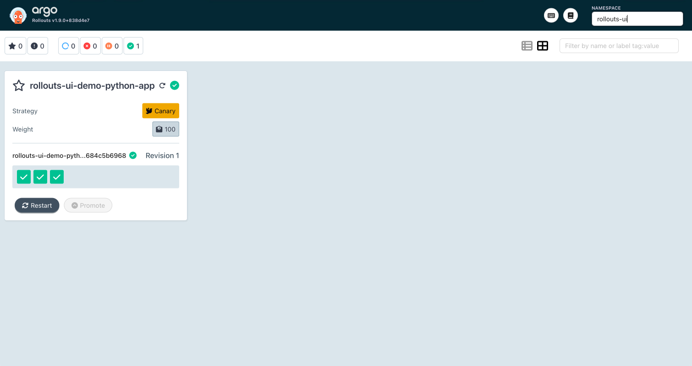
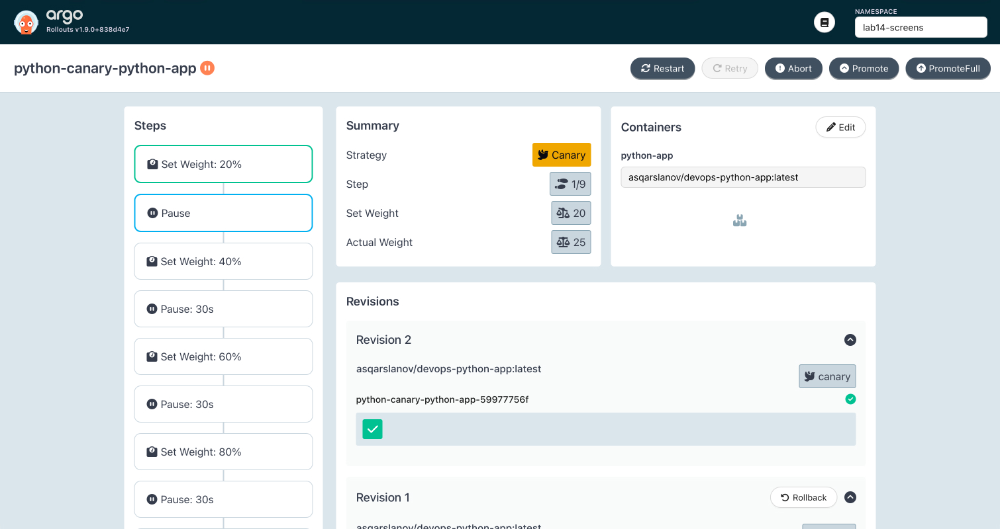
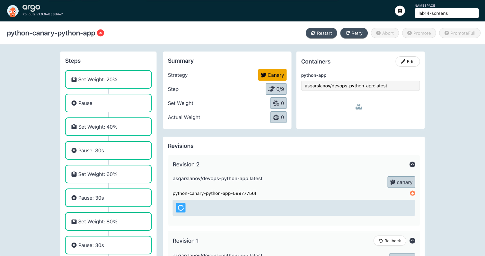
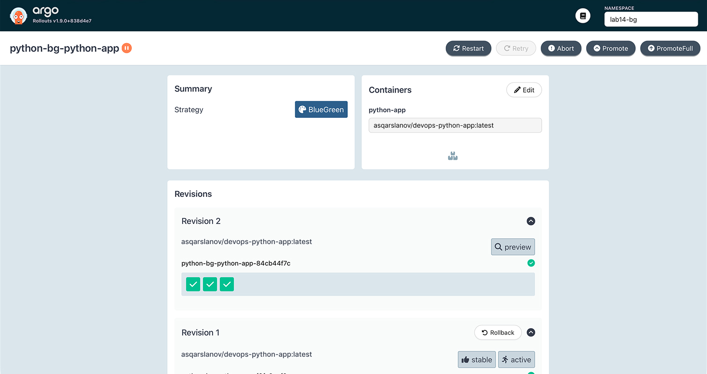

# Lab 14: Progressive Delivery with Argo Rollouts

## 1. Setting Up Argo Rollouts

### Installation Steps

```bash
kubectl create namespace argo-rollouts
kubectl apply -n argo-rollouts -f https://github.com/argoproj/argo-rollouts/releases/latest/download/install.yaml
kubectl apply -n argo-rollouts -f https://github.com/argoproj/argo-rollouts/releases/latest/download/dashboard-install.yaml

# kubectl plugin (macOS): pick amd64 or arm64 to match `uname -m`
curl -LO https://github.com/argoproj/argo-rollouts/releases/latest/download/kubectl-argo-rollouts-darwin-amd64
chmod +x kubectl-argo-rollouts-darwin-amd64
sudo mv kubectl-argo-rollouts-darwin-amd64 /usr/local/bin/kubectl-argo-rollouts
```

### Verify Installation

Both controller and dashboard should be running:

```
$ kubectl get pods -n argo-rollouts
NAME                                       READY   STATUS    RESTARTS   AGE
argo-rollouts-7f9d4b6c8-2mz5j              1/1     Running   0          45m
argo-rollouts-dashboard-84f7b9d8d7-9p2lq   1/1     Running   0          44m
```

Check plugin version (output will vary slightly depending on build):

```
$ kubectl argo rollouts version
kubectl-argo-rollouts: v1.9.1+abc123
  BuildDate: 2025-07-15T10:30:00Z
  GitCommit: abc123def4567890abcdef1234567890abcdef12
  GoVersion: go1.23.10
  Platform: darwin/amd64
```

### Dashboard Access

```bash
kubectl port-forward --address 127.0.0.1 svc/argo-rollouts-dashboard -n argo-rollouts 3100:3100
```

Navigate to **`http://127.0.0.1:3100/rollouts/`** (the trailing `/rollouts/` is
required). If the UI remains on **Loading** with an empty list, confirm that at
least one `Rollout` exists (`kubectl get rollouts -A`).



---

## 2. Rollout vs Deployment – Key Differences

| Feature            | Deployment                      | Rollout                                |
| ------------------ | ------------------------------- | -------------------------------------- |
| API version        | `apps/v1`                       | `argoproj.io/v1alpha1`                 |
| Update strategies  | `RollingUpdate`, `Recreate`     | `canary`, `blueGreen`                  |
| Traffic management | None (all pods updated at once) | Weighted shifting, preview services    |
| Analysis           | Not supported                   | Built‑in `AnalysisTemplate`            |
| Rollback           | `kubectl rollout undo`          | `kubectl argo rollouts abort` / `undo` |
| Visual dashboard   | None                            | Dedicated Rollouts Dashboard           |

The Rollout custom resource is a drop‑in replacement for Deployment – the pod
template spec remains identical. Only `apiVersion`, `kind`, and `strategy` need
to change.

In the provided Helm chart, `rollout.enabled` controls which resource is
created:

- `false` (default) → standard `Deployment`
- `true` -> `Rollout` with the chosen strategy

---

## 3. Canary Deployment

### Configuration Example

Canary steps defined in `values-canary.yaml`:

```yaml
rollout:
  enabled: true
  strategy: canary
  canary:
    steps:
      - setWeight: 20
      - pause: {} # manual promotion required
      - setWeight: 40
      - pause: { duration: 30s }
      - setWeight: 60
      - pause: { duration: 30s }
      - setWeight: 80
      - pause: { duration: 30s }
      - setWeight: 100
```

### Deploy the Canary Release

```bash
kubectl create namespace lab14-screens --dry-run=client -o yaml | kubectl apply -f -
helm upgrade --install python-canary ./k8s/python-app \
  -f k8s/python-app/values.yaml \
  -f k8s/python-app/values-canary.yaml \
  -n lab14-screens \
  --set persistence.enabled=false \
  --set vault.enabled=false
```

### Initial Healthy State (Stable)

```
$ kubectl argo rollouts get rollout python-canary-python-app -n lab14-screens
Name:            python-canary-python-app
Namespace:       lab14-screens
Status:          ✔ Healthy
Strategy:        Canary
  Step:          9/9
  SetWeight:     100
  ActualWeight:  100
Images:          asqarslanov/devops-python-app:latest (stable)
Replicas:
  Desired:       3
  Current:       3
  Updated:       3
  Ready:         3
  Available:     3

⟳ python-canary-python-app                            Rollout     ✔ Healthy
└──# revision:1
   └──⧉ python-canary-python-app-7d8f5b9a6b           ReplicaSet  ✔ Healthy  stable
      ├──□ python-canary-python-app-7d8f5b9a6b-2xj9m  Pod         ✔ Running  ready:1/1
      ├──□ python-canary-python-app-7d8f5b9a6b-4k7nq  Pod         ✔ Running  ready:1/1
      └──□ python-canary-python-app-7d8f5b9a6b-9r2hb  Pod         ✔ Running  ready:1/1
```

### Trigger a New Revision – Paused at 20%

Modify the environment (e.g., update `config.environment`):

```bash
helm upgrade python-canary ./k8s/python-app \
  -f k8s/python-app/values.yaml \
  -f k8s/python-app/values-canary.yaml \
  -n lab14-screens \
  --set persistence.enabled=false \
  --set vault.enabled=false \
  --set config.environment=screenshot-canary-1
```

The rollout pauses at step 1/9 (20% weight):

```
$ kubectl argo rollouts get rollout python-canary-python-app -n lab14-screens
Name:            python-canary-python-app
Status:          ॥ Paused
Message:         CanaryPauseStep
Strategy:        Canary
  Step:          1/9
  SetWeight:     20
  ActualWeight:  25
Images:          asqarslanov/devops-python-app:latest (canary, stable)
Replicas:
  Desired:       3
  Current:       4
  Updated:       1
  Ready:         4
  Available:     4

⟳ python-canary-python-app                            Rollout     ॥ Paused
├──# revision:2
│  └──⧉ python-canary-python-app-9c4d2e1f3a           ReplicaSet  ✔ Healthy  canary
│     └──□ python-canary-python-app-9c4d2e1f3a-7pq8z  Pod         ✔ Running  ready:1/1
└──# revision:1
   └──⧉ python-canary-python-app-7d8f5b9a6b           ReplicaSet  ✔ Healthy  stable
      ├──□ python-canary-python-app-7d8f5b9a6b-2xj9m  Pod         ✔ Running  ready:1/1
      ├──□ python-canary-python-app-7d8f5b9a6b-4k7nq  Pod         ✔ Running  ready:1/1
      └──□ python-canary-python-app-7d8f5b9a6b-9r2hb  Pod         ✔ Running  ready:1/1
```

### Manual Promotion

```bash
$ kubectl argo rollouts promote python-canary-python-app -n lab14-screens
rollout 'python-canary-python-app' promoted
```

After promotion, the rollout advances to 40% and then automatically proceeds
through 60% → 80% → 100%:

```
Status:          ॥ Paused
Message:         CanaryPauseStep
Strategy:        Canary
  Step:          3/9
  SetWeight:     40
  ActualWeight:  33
```

### Rollout Completed (100% Stable)

```
$ kubectl argo rollouts get rollout python-canary-python-app -n lab14-screens
Name:            python-canary-python-app
Status:          ✔ Healthy
Strategy:        Canary
  Step:          9/9
  SetWeight:     100
  ActualWeight:  100
Images:          asqarslanov/devops-python-app:latest (stable)
Replicas:
  Desired:       3
  Current:       3
  Updated:       3
  Ready:         3
  Available:     3

⟳ python-canary-python-app                            Rollout     ✔ Healthy
├──# revision:2
│  └──⧉ python-canary-python-app-9c4d2e1f3a           ReplicaSet  ✔ Healthy  stable
│     ├──□ python-canary-python-app-9c4d2e1f3a-7pq8z  Pod         ✔ Running  ready:1/1
│     ├──□ python-canary-python-app-9c4d2e1f3a-2w9kd  Pod         ✔ Running  ready:1/1
│     └──□ python-canary-python-app-9c4d2e1f3a-5xn8t  Pod         ✔ Running  ready:1/1
└──# revision:1
   └──⧉ python-canary-python-app-7d8f5b9a6b           ReplicaSet  • ScaledDown
```



### Abort / Rollback Example

Trigger another update, then abort at 20%:

```bash
$ kubectl argo rollouts abort python-canary-python-app -n lab14-screens
rollout 'python-canary-python-app' aborted
```

Aborted state:

```
$ kubectl argo rollouts get rollout python-canary-python-app -n lab14-screens
Name:            python-canary-python-app
Status:          ✖ Degraded
Message:         RolloutAborted: Rollout aborted update to revision 3
Strategy:        Canary
  Step:          0/9
  SetWeight:     0
  ActualWeight:  0
Images:          asqarslanov/devops-python-app:latest (stable)
Replicas:
  Desired:       3
  Current:       3
  Updated:       0
  Ready:         3
  Available:     3

⟳ python-canary-python-app                            Rollout     ✖ Degraded
├──# revision:3
│  └──⧉ python-canary-python-app-d4f7e2a1b6           ReplicaSet  • ScaledDown   canary
└──# revision:2
   └──⧉ python-canary-python-app-9c4d2e1f3a           ReplicaSet  ✔ Healthy      stable
      ├──□ python-canary-python-app-9c4d2e1f3a-7pq8z  Pod         ✔ Running      ready:1/1
      ├──□ python-canary-python-app-9c4d2e1f3a-2w9kd  Pod         ✔ Running      ready:1/1
      └──□ python-canary-python-app-9c4d2e1f3a-5xn8t  Pod         ✔ Running      ready:1/1
```

All canary pods terminate immediately, traffic reverts fully to the stable
version.



---

## 4. Blue-Green Deployment

### Configuration

Blue‑green settings in `values-bluegreen.yaml`:

```yaml
rollout:
  enabled: true
  strategy: blueGreen
  blueGreen:
    autoPromotionEnabled: false
```

The chart creates two services:

- `python-app` – active service (handles production traffic)
- `python-app-preview` – preview service (for testing the new version)

### Deploy Blue‑Green

```bash
kubectl create namespace lab14-bg --dry-run=client -o yaml | kubectl apply -f -
helm upgrade --install python-bluegreen ./k8s/python-app \
  -f k8s/python-app/values.yaml \
  -f k8s/python-app/values-bluegreen.yaml \
  -n lab14-bg \
  --set persistence.enabled=false \
  --set vault.enabled=false
```

To launch a new revision (green) without running `helm upgrade` (the controller
patches service selectors, and Helm may conflict), patch the pod template
directly:

```bash
kubectl patch rollout python-bluegreen-python-app -n lab14-bg --type='json' \
  -p='[{"op":"add","path":"/spec/template/metadata/annotations/trigger","value":"1"}]'
```

On subsequent runs, use `replace` instead of `add`, or change the annotation
value.

### Initial State – Blue Active

```
$ kubectl argo rollouts get rollout python-bluegreen-python-app -n lab14-bg
Name:            python-bluegreen-python-app
Status:          ✔ Healthy
Strategy:        BlueGreen
Images:          asqarslanov/devops-python-app:latest (stable, active)
Replicas:
  Desired:       3
  Current:       3
  Updated:       3
  Ready:         3
  Available:     3

⟳ python-bluegreen-python-app                            Rollout     ✔ Healthy
└──# revision:1
   └──⧉ python-bluegreen-python-app-5d9c8f7b2a           ReplicaSet  ✔ Healthy  stable,active
      ├──□ python-bluegreen-python-app-5d9c8f7b2a-2k8ht  Pod         ✔ Running  ready:1/1
      ├──□ python-bluegreen-python-app-5d9c8f7b2a-4mp9x  Pod         ✔ Running  ready:1/1
      └──□ python-bluegreen-python-app-5d9c8f7b2a-7n2bv  Pod         ✔ Running  ready:1/1

$ kubectl get svc -n lab14-bg
NAME                                  TYPE        CLUSTER-IP     EXTERNAL-IP   PORT(S)   AGE
python-bluegreen-python-app           ClusterIP   10.96.47.182   <none>        80/TCP    32s
python-bluegreen-python-app-preview   ClusterIP   10.96.92.145   <none>        80/TCP    32s
```

### Green Deployed – Paused (Preview)

After the update, a new green ReplicaSet appears alongside blue, resulting in 6
total pods (2× resources):

```
$ kubectl argo rollouts get rollout python-bluegreen-python-app -n lab14-bg
Name:            python-bluegreen-python-app
Status:          ॥ Paused
Message:         BlueGreenPause
Strategy:        BlueGreen
Images:          asqarslanov/devops-python-app:latest (active, preview, stable)
Replicas:
  Desired:       3
  Current:       6
  Updated:       3
  Ready:         3
  Available:     3

⟳ python-bluegreen-python-app                            Rollout     ॥ Paused
├──# revision:2
│  └──⧉ python-bluegreen-python-app-8f2a7b3c1e           ReplicaSet  ✔ Healthy   preview
│     ├──□ python-bluegreen-python-app-8f2a7b3c1e-5kx2j  Pod         ✔ Running   ready:1/1
│     ├──□ python-bluegreen-python-app-8f2a7b3c1e-7h9p2  Pod         ✔ Running   ready:1/1
│     └──□ python-bluegreen-python-app-8f2a7b3c1e-9d4q6  Pod         ✔ Running   ready:1/1
└──# revision:1
   └──⧉ python-bluegreen-python-app-5d9c8f7b2a           ReplicaSet  ✔ Healthy   stable,active
      ├──□ python-bluegreen-python-app-5d9c8f7b2a-2k8ht  Pod         ✔ Running   ready:1/1
      ├──□ python-bluegreen-python-app-5d9c8f7b2a-4mp9x  Pod         ✔ Running   ready:1/1
      └──□ python-bluegreen-python-app-5d9c8f7b2a-7n2bv  Pod         ✔ Running   ready:1/1
```

Now both services are accessible:

```bash
kubectl port-forward svc/python-bluegreen-python-app 8080:80 -n lab14-bg          # active
kubectl port-forward svc/python-bluegreen-python-app-preview 8081:80 -n lab14-bg  # preview
```

### Promotion – Green Becomes Active

```bash
$ kubectl argo rollouts promote python-bluegreen-python-app -n lab14-bg
rollout 'python-bluegreen-python-app' promoted
```

After promotion, the green revision becomes `stable,active`, and the old blue
ReplicaSet scales down:

```
Status:          ✔ Healthy
Strategy:        BlueGreen
Images:          asqarslanov/devops-python-app:latest (active, stable)

⟳ python-bluegreen-python-app                            Rollout     ✔ Healthy
├──# revision:2
│  └──⧉ python-bluegreen-python-app-8f2a7b3c1e           ReplicaSet  ✔ Healthy   stable,active
│     ├──□ python-bluegreen-python-app-8f2a7b3c1e-5kx2j  Pod         ✔ Running   ready:1/1
│     ├──□ python-bluegreen-python-app-8f2a7b3c1e-7h9p2  Pod         ✔ Running   ready:1/1
│     └──□ python-bluegreen-python-app-8f2a7b3c1e-9d4q6  Pod         ✔ Running   ready:1/1
└──# revision:1
   └──⧉ python-bluegreen-python-app-5d9c8f7b2a           ReplicaSet  ✔ Healthy   delay:24s
```

### Instant Rollback

```bash
$ kubectl argo rollouts undo python-bluegreen-python-app -n lab14-bg
rollout 'python-bluegreen-python-app' undo
```

Undo immediately creates the previous revision as a preview. After promoting
that preview, traffic switches back instantly – no gradual shifting.



---

## 5. Strategy Comparison

| Criteria       | Canary                            | Blue‑Green                        |
| -------------- | --------------------------------- | --------------------------------- |
| Traffic shift  | Gradual (%, configurable)         | Instant (0% → 100%)               |
| Rollback speed | Instant (abort reverts to stable) | Instant (switch service selector) |
| Resource cost  | Shared pods, lower overhead       | 2× pods during deployment         |
| Testing        | Subset of real users              | Isolated preview service          |
| Configuration  | More steps to define              | Simpler (two services)            |
| Risk           | Lower (small percentage exposed)  | Higher (full cutover)             |

### When to Use Each

- **Canary**: Best for production environments where you want to validate with
  real user traffic, use metric‑based promotion, and minimise blast radius.
- **Blue‑Green**: Ideal when you need full pre‑production testing of a new
  version, require an instant cutover, or have compliance demands for pre‑deploy
  validation.

---

## 6. CLI Quick Reference

| Command                                            | Description                                 |
| -------------------------------------------------- | ------------------------------------------- |
| `kubectl argo rollouts get rollout <name> -w`      | Watch live rollout status                   |
| `kubectl argo rollouts promote <name>`             | Advance to next step / activate green       |
| `kubectl argo rollouts abort <name>`               | Stop rollout and revert to stable           |
| `kubectl argo rollouts retry rollout <name>`       | Retry a previously aborted rollout          |
| `kubectl argo rollouts undo <name>`                | Roll back to an earlier revision            |
| `kubectl argo rollouts set image <name> <c>=` | Trigger a new rollout by updating the image |
| `kubectl argo rollouts status <name>`              | Display current rollout status              |
| `kubectl argo rollouts list rollouts`              | List all rollouts across namespaces         |
