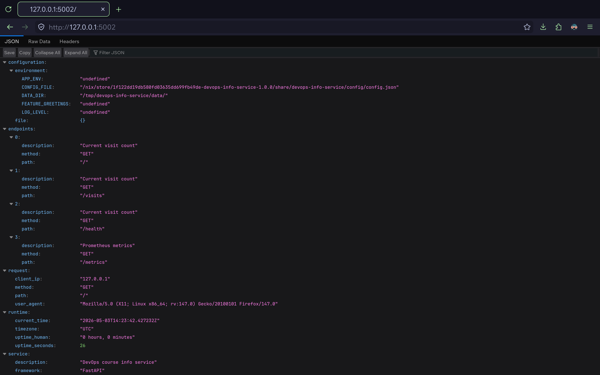
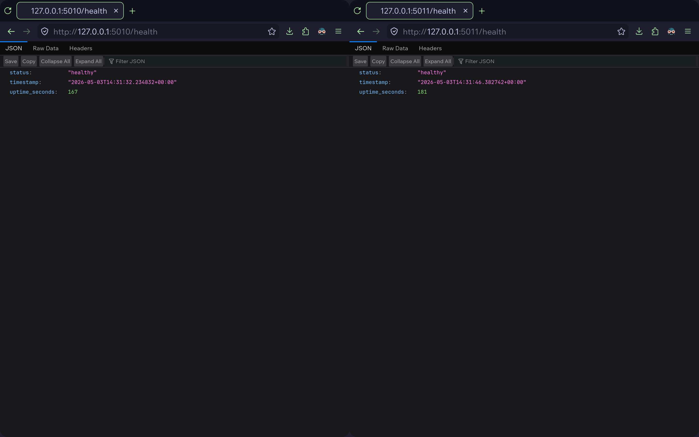

# Lab 18: Reproducible Builds with Nix

## Overview

Lab 18 rebuilds the DevOps Info Service from Labs 1 and 2 with Nix in order to
prove reproducibility for both the application package and the container image.

Implementation files:

- `labs/lab18/app_python/default.nix`
- `labs/lab18/app_python/docker.nix`
- `labs/lab18/app_python/flake.nix`
- `labs/lab18/app_python/flake.lock`
- `labs/lab18/app_python/app.py`
- `labs/lab18/app_python/requirements.txt`

## Installation Notes

The recommended host installation path for Nix requires `sudo` privileges to
create `/nix` and modify system shell integration. That step was blocked in the
current environment because the local administrator password was not available.

To keep the lab reproducible and still execute real Nix builds, the official
container image `nixos/nix:2.28.3` was used for the build and verification
steps. This preserved the required Nix workflow while avoiding unsupported host
changes.

## Task 1 - Reproducible Python Application

### `default.nix` Explanation

`default.nix` builds the service as a deterministic package:

- `cleanSourceWith` excludes `result`, `__pycache__`, and `*.pyc` so build
  outputs do not feed back into the source hash
- `python3.withPackages` provides `fastapi`, `uvicorn`, `prometheus-client`, and
  `python-json-logger`
- `stdenvNoCC.mkDerivation` creates a lightweight package without a compile
  phase
- `makeWrapper` exposes a stable launcher named `devops-info-service`
- default environment values are set for `HOST=0.0.0.0` and `PORT=5000`

### Store Path Reproducibility

Two independent `nix-build` runs produced the same store path:

```text
/nix/store/1f122dd19db580fd03635dd699fb49de-devops-info-service-1.0.0
/nix/store/1f122dd19db580fd03635dd699fb49de-devops-info-service-1.0.0
```

### Explanation of the Nix Store Path

`/nix/store/1f122dd19db580fd03635dd699fb49de-devops-info-service-1.0.0`

|                                    |                                              |
| ---------------------------------- | -------------------------------------------- |
| `/nix/store`                       | Global immutable store for Nix build outputs |
| `1f122dd19db580fd03635dd699fb49de` | hash derived from all build inputs           |
| `devops-info-service`              | package name                                 |
| `1.0.0`                            | declared package version                     |

If any input changes, the hash changes. If no input changes, the same store path
is reused or rebuilt identically.

### Running the Nix-Built Application

The packaged service was started and verified successfully. Captured output
shows:

- `GET /health` returned HTTP `200`
- `GET /visits` returned HTTP `200`
- application startup and request logs were emitted in structured JSON

Observed `/health` response:

```json
{
  "status": "healthy",
  "timestamp": "2026-04-22T09:08:15.847122+00:00",
  "uptime_seconds": 3
}
```

Observed `/visits` response:

```json
{ "visits": 0 }
```



### `pip install` vs Nix Comparison

|                       | Original (lab 1)                     | Diff (lab 18)                                 |
| --------------------- | ------------------------------------ | --------------------------------------------- |
| Python runtime        | Taken from host                      | Resolved from pinned `nixpkgs`                |
| Dependency resolution | Depends on PyPI and host environment | Derived from exact Nix inputs                 |
| Isolation             | Virtual environment only             | Pure build closure                            |
| Rebuild output        | Not guaranteed to match              | Deterministic store path                      |
| Reuse and caching     | Tool-specific, often imperative      | Content-addressed and transparent             |
| Portability           | Requires similar host setup          | Works wherever Nix supports the target system |

### Why `requirements.txt` Provides Weaker Guarantees

`requirements.txt` describes Python package versions but does not capture the
full build graph:

- the Python interpreter version can differ
- transitive dependencies can change when not fully hashed and pinned
- build-time tools and system libraries are outside the file
- the surrounding operating system and package manager state are not represented

Nix models the complete derivation, including the interpreter and dependency
set, which is why the result is reproducible.

### Reflection for Task 1

If Nix had been used from the beginning of Lab 1, onboarding and CI verification
would have been less sensitive to host drift. The exact runtime would have been
documented declaratively instead of being reconstructed procedurally with `venv`
and `pip`.

## Task 2 - Reproducible Docker Images

### `docker.nix` Explanation

`docker.nix` packages the Nix-built application into a deterministic image:

- `dockerTools.buildLayeredImage` creates the image from derivations
- `contents = [ app ]` includes only the packaged application closure
- `Cmd` runs `${app}/bin/devops-info-service`
- `ExposedPorts` publishes `5000/tcp`
- `created = "1970-01-01T00:00:01Z"` removes build timestamp drift

### Nix Docker Image Reproducibility

Two image tarballs built from the Nix definition have identical SHA256 digests:

```text
6c7a497506886d03de03a412f14d7747e89f0a075045d5ad9965da19d18dd14d  labs/lab18/app_python/devops-info-service-nix-build1.tar.gz
6c7a497506886d03de03a412f14d7747e89f0a075045d5ad9965da19d18dd14d  labs/lab18/app_python/devops-info-service-nix-build2.tar.gz
```



This proves that the generated tarballs are bit-for-bit identical.

### Traditional Dockerfile Comparison

The original Lab 2 Docker build was executed twice with `--no-cache`. The
results differ:

|                    | First build                                                        | Second build                                                       |
| ------------------ | ------------------------------------------------------------------ | ------------------------------------------------------------------ |
| Created timestamp  | `2026-05-03T12:10:34.861675563+03:00`                              | `2026-05-03T12:10:49.464574697+03:00`                              |
| Docker image size  | `181832147`                                                        | `181832147`                                                        |
| Saved image SHA256 | `51833174746ea4bb73eaf2aa216a229cae201899c99ee435c9c0c0ccb662cc9e` | `a1e290bab556cc85cb72a2cb75bb9a0aba45b447088f003833d523d9dccc529e` |

### Dockerfile vs `dockerTools`

|                         | Traditional Dockerfile                     | Nix `dockerTools`                          |
| ----------------------- | ------------------------------------------ | ------------------------------------------ |
| Base image              | External mutable tag                       | No mutable base image tag required         |
| Timestamp behavior      | New creation time on every build           | Fixed deterministic creation time          |
| Dependency installation | Imperative `pip install` during build      | Immutable Nix store closure                |
| Reproducibility         | Different image hash on identical source   | Identical tarball hash on identical source |
| Auditing                | Layer history plus external registry state | Derivation-driven inputs and lock file     |
| Caching model           | Layer cache and build context semantics    | Content-addressed derivations              |

### Why Traditional Dockerfiles Are Not Bit-for-Bit Reproducible

Traditional Docker builds embed mutable inputs such as:

- image creation timestamps
- mutable base image tags
- package manager repository state
- layer ordering and archive metadata

Even when the application source is unchanged, these moving parts cause
different final hashes. Nix avoids this by deriving the image from immutable
store paths and a deterministic image definition.

### Practical Impact

Deterministic images matter in:

- CI/CD pipelines, where rebuilds should match promoted artifacts
- security audits, where the exact binary under review must be reproducible
- rollback workflows, where image identity must be trustworthy
- long-lived projects, where base image drift otherwise breaks historical
  rebuilds

### Reflection for Task 2

If Lab 2 were repeated with Nix from the start, the application package would be
built first as a reproducible derivation and then composed into the image as a
stable closure. That would remove most of the uncertainty caused by imperative
package installation inside Docker layers.

## Bonus Task: Flakes and Lab 10 Comparison

### `flake.nix` and `flake.lock`

The bonus task was completed by adding:

- `flake.nix` with package outputs for `x86_64-linux`, `aarch64-linux`,
  `x86_64-darwin`, and `aarch64-darwin`
- `flake.lock` pinning `nixpkgs` to commit
  `c2b86b5455411f67c0d91e4e6fe523df561353e3`

This makes the dependency source explicit and shareable across machines.

### Helm Values vs Nix Flakes

|                   | Helm value pinning (lab 10)         | Nix Flakes (lab 18)                         |
| ----------------- | ----------------------------------- | ------------------------------------------- |
| Primary target    | Kubernetes deployment configuration | Full build and dependency graph             |
| Locked unit       | Image tags and chart values         | `nixpkgs` input revision and derivations    |
| Scope             | Deployment-time configuration       | Build-time and package-time reproducibility |
| Rebuild guarantee | Limited                             | Strong                                      |

Flakes extend the same idea used in Helm version pinning, but they do so at the
entire package graph level rather than only at the container image or values
layer.
