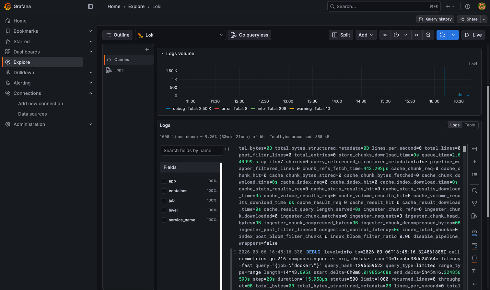
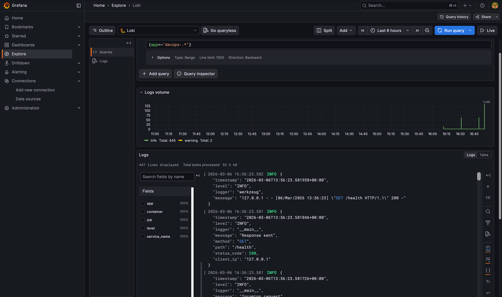
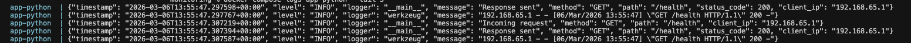
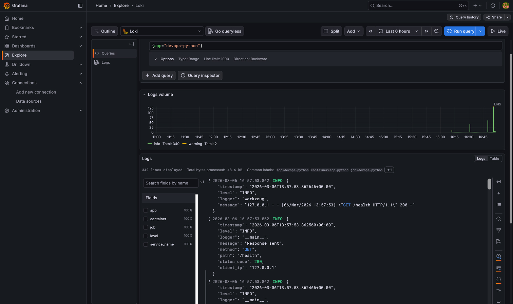
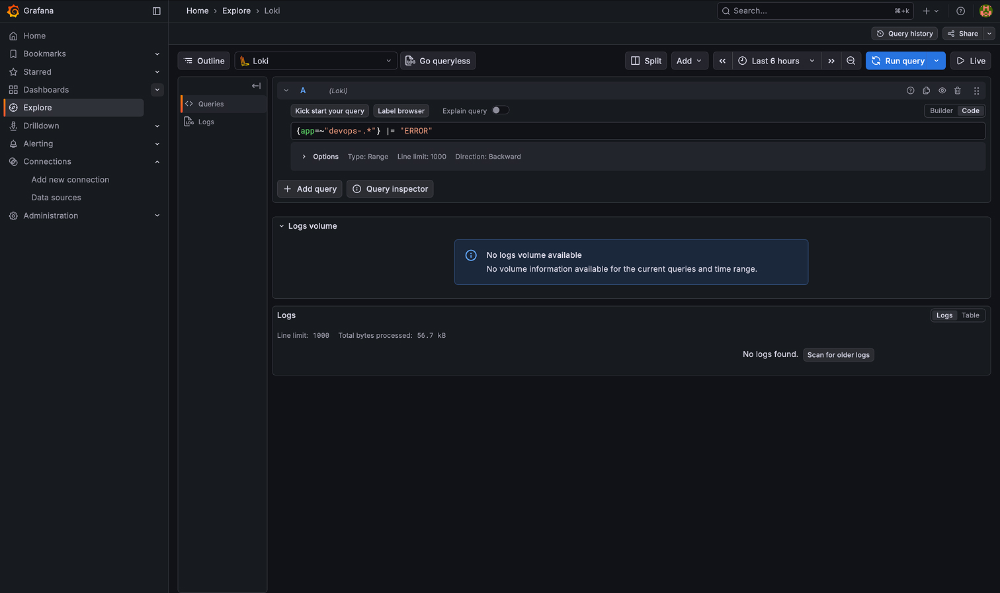
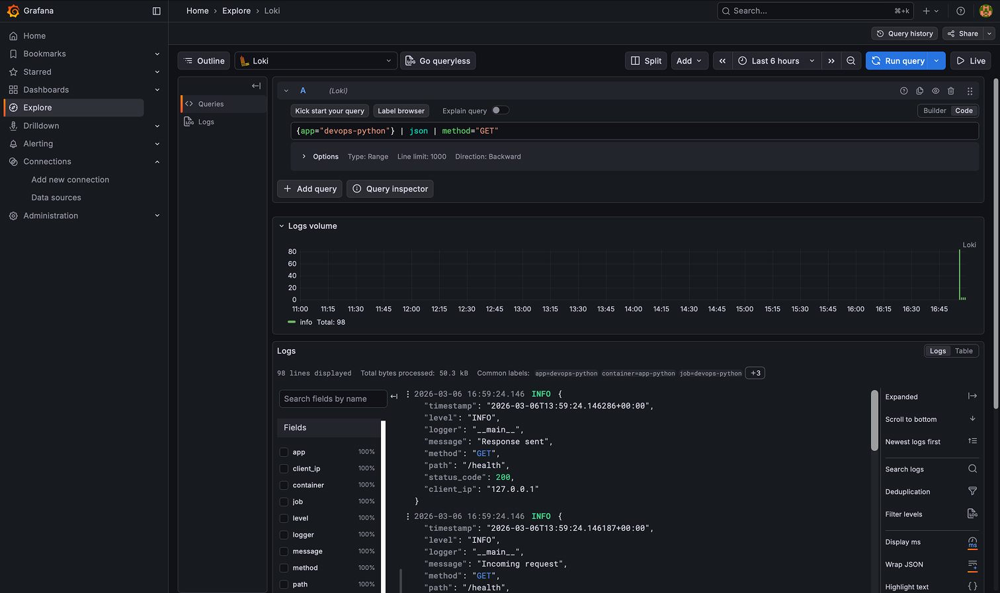
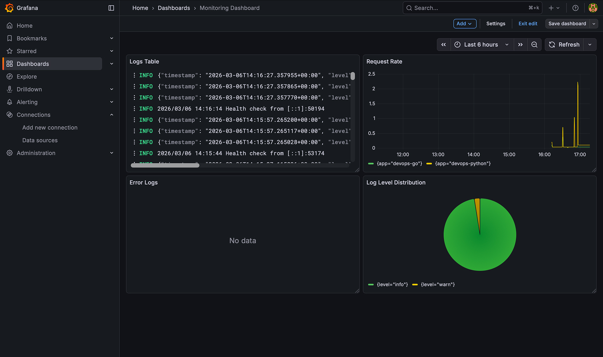
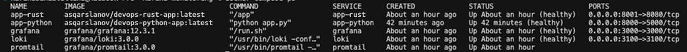
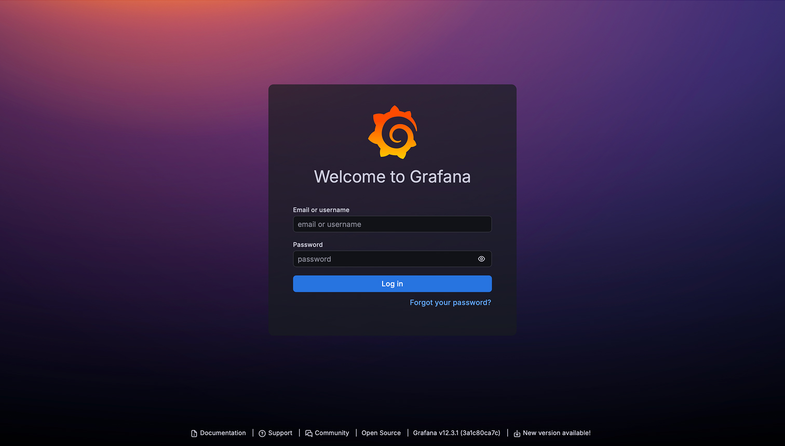

# Lab 7: Building an Observability Stack with Loki, Promtail, and Grafana

This lab walks through setting up a complete logging and observability solution
using the Loki stack. The goal was to collect, store, and visualize logs from
containerized applications running both Python (FastAPI) and Rust services.

## System Architecture

The setup consists of several moving parts working together. Here's how
everything connects:

- `app-python:8000` and `app-rust:8001` sned logs to `Promtail:9080` (Docker SD
  via socket) that pushes data to `Loki:3001` which is queried to
  `Grafana:3000`.

**Components:**

- **Loki 3.0** — Handles log aggregation. We're using the TSDB index with schema
  v13, which apparently gives up to 10x faster query performance compared to the
  older boltdb-shipper approach. Storage is on the local filesystem, which works
  fine for a single-instance setup.
- **Promtail 3.0** — Acts as the log collector. It uses Docker service discovery
  to automatically find containers by reading from the Docker socket at
  `/var/run/docker.sock`.
- **Grafana 12.3** — Provides the visualization layer. This is where we query
  logs using LogQL and build dashboards.
- **Applications** — Two services: a Python FastAPI app on port 8000 and a Rust
  service on port 8001, both configured to output JSON-formatted logs.

All containers communicate over a Docker bridge network called `logging`.
Promtail is configured to only scrape containers that have the label
`logging=promtail`.

## Getting Started

The setup is pretty straightforward thanks to Docker Compose. Here's what needs
to be done:

1. Navigate to the monitoring directory:

   ```bash
   cd monitoring
   ```

2. Create a `.env` file with Grafana admin credentials:

   ```bash
   # GF_SECURITY_ADMIN_USER=admin
   # GF_SECURITY_ADMIN_PASSWORD=<your_password>
   ```

3. Start everything:

   ```bash
   docker compose up --detach
   ```

4. Check that all services are up:

   ```bash
   docker compose ps
   ```

5. Verify health endpoints:
   ```bash
   curl http://localhost:3100/ready    
   curl http://localhost:3000/api/health
   ```

**Task 1 Deliverable:**

- 

To generate some test traffic and see logs in action:

```bash
for i in {1..20}; do curl http://localhost:8000/; done
for i in {1..20}; do curl http://localhost:8001/; done
```

## Configuration Details

### Loki Configuration (`loki/config.yml`)

Loki is configured to use TSDB indexing with schema v13, which is the
recommended approach for Loki 3.0. The filesystem backend keeps things simple
for single-node deployments. There's also a compactor running every 10 minutes
that enforces a 7-day retention policy (168 hours), automatically cleaning up
old logs.

```yaml
schema_config:
  configs:
    - from: "2024-01-01"
      store: tsdb
      object_store: filesystem
      schema: v13
```

### Promtail Configuration (`promtail/config.yml`)

Promtail discovers containers through Docker's service discovery mechanism. It
connects to the Docker socket and polls every 5 seconds for new containers. The
key part here is the filter — we only scrape containers that have the label
`logging=promtail`, which prevents picking up logs from every single container
on the system.

```yaml
docker_sd_configs:
  - host: unix:///var/run/docker.sock
    refresh_interval: 5s
    filters:
      - name: label
        values: ["logging=promtail"]
```

There's also some relabeling magic that strips the leading `/` that Docker
prepends to container names and extracts an `app` label for easier querying.

## Application Logging Format

The Python application uses a custom `JSONFormatter` to produce structured logs
instead of plain text. This is much better for querying and filtering in
Grafana. Each log entry looks like this:

```json
{
  "timestamp": "2026-03-05T12:00:00+00:00",
  "level": "INFO",
  "logger": "app",
  "message": "Response sent",
  "method": "GET",
  "path": "/",
  "status_code": 200,
  "client_ip": "172.18.0.1"
}
```

The FastAPI app uses `@app.before_request` and `@app.after_request` hooks to
automatically capture every HTTP request and response, including the method,
path, status code, and client IP address. This gives us detailed visibility into
what's happening with the application without manual instrumentation.

**Task 2 Deliverables:**

- 
- 
- 
- 
- 

## Grafana Dashboard

The dashboard includes four panels that provide different views of the log data:

| Panel # | Name                   | Type        | LogQL Query                                                         |
| ------- | ---------------------- | ----------- | ------------------------------------------------------------------- |
| 1       | Logs Table             | Logs        | `{app=~"devops-.*"}`                                                |
| 2       | Request Rate           | Time series | `sum by (app) (rate({app=~"devops-.*"} [1m]))`                      |
| 3       | Error Logs             | Logs        | `{app=~"devops-.*"} \| json \| level="ERROR"`                       |
| 4       | Log Level Distribution | Pie chart   | `sum by (level) (count_over_time({app=~"devops-.*"} \| json [5m]))` |

The pie chart is particularly nice for quickly seeing the distribution of log
levels across the application.

**Task 3 Deliverable:**

- 

## Production-Ready Configuration

For a more realistic deployment, several hardening measures were added:

- **Authentication:** Anonymous access is disabled in Grafana. The admin
  credentials are stored in a `.env` file that's not committed to version
  control.
- **Resource limits:** All services have CPU and memory limits and reservations
  configured in docker-compose.
- **Health checks:** Both Loki (`/ready`) and Grafana (`/api/health`) have
  health check configurations with retries and startup periods.
- **Retention:** The 7-day retention is enforced automatically by Loki's
  compactor.
- **Security:** Configuration files and the Docker socket are mounted as
  read-only (`:ro`) to prevent accidental modifications.
- **Restart policy:** All services use `unless-stopped` to survive host reboots.

**Task 4 Deliverables:**

- 
- 

## Verification Commands

Here are some useful commands for testing the stack:

```bash
# Check all services are running
docker compose ps

# Test Loki health
curl -s http://localhost:3100/ready

# Test Grafana health
curl -s http://localhost:3000/api/health

# Generate test requests
for i in {1..20}; do curl -s http://localhost:8000/ > /dev/null; done

# Query logs via Loki API directly
curl -G -s http://localhost:3100/loki/api/v1/query \
  --data-urlencode 'query={app="devops-python"}' | jq .status

# Check JSON logs directly from container
docker compose logs app-python --tail 5
```

## Automating with Ansible (Bonus)

For those interested in automation, there's an Ansible role called `monitoring`
that handles the entire deployment. The playbook is located at
`ansible/playbooks/deploy-monitoring.yml`.

The role performs these tasks:

1. Creates necessary directories under `/opt/monitoring`
2. Templates out Loki, Promtail, and Grafana configuration files
3. Runs Docker Compose to bring up the stack
4. Waits for services to become healthy

It depends on the `docker` role which handles installing Docker and its
prerequisites.

The first run shows the deployment happening:

```
PLAY [Deploy Monitoring Stack (Loki + Promtail + Grafana)] ***
TASK [Gathering Facts] ***
ok: [lab4-vm]
TASK [docker : Install prerequisites for Docker repository] ***
ok: [lab4-vm]
TASK [monitoring : Setup monitoring directory and configs] ***
included: .../tasks/setup.yml for lab4-vm
TASK [monitoring : Deploy monitoring stack with Docker Compose] ***
changed: [lab4-vm]
PLAY RECAP ***
lab4-vm : ok=20   changed=1    unreachable=0    failed=0
```

The second run demonstrates idempotency — no changes are made because everything
is already in the desired state:

```
PLAY RECAP ***
lab4-vm : ok=20   changed=0    unreachable=0    failed=0
```

## Common Pitfalls

A few things that can trip you up:

1. **Loki 3.0 TSDB configuration:** Schema v13 requires the `tsdb_shipper` block
   with `active_index_directory` and `cache_location`. A lot of older tutorials
   still show the deprecated `boltdb-shipper` syntax which won't work.

2. **Promtail Docker SD filters:** The `filters` block needs to be nested inside
   `docker_sd_configs`, not at the `scrape_configs` level. This caught me out
   initially.

3. **Container name prefix:** Docker prepends a `/` to all container names. The
   relabeling rule `"/?(.*)"` removes this so you get clean labels like
   `devops-python` instead of `/devops-python`.
