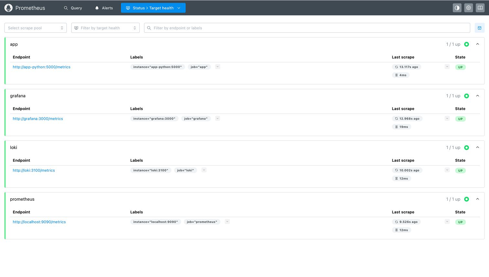
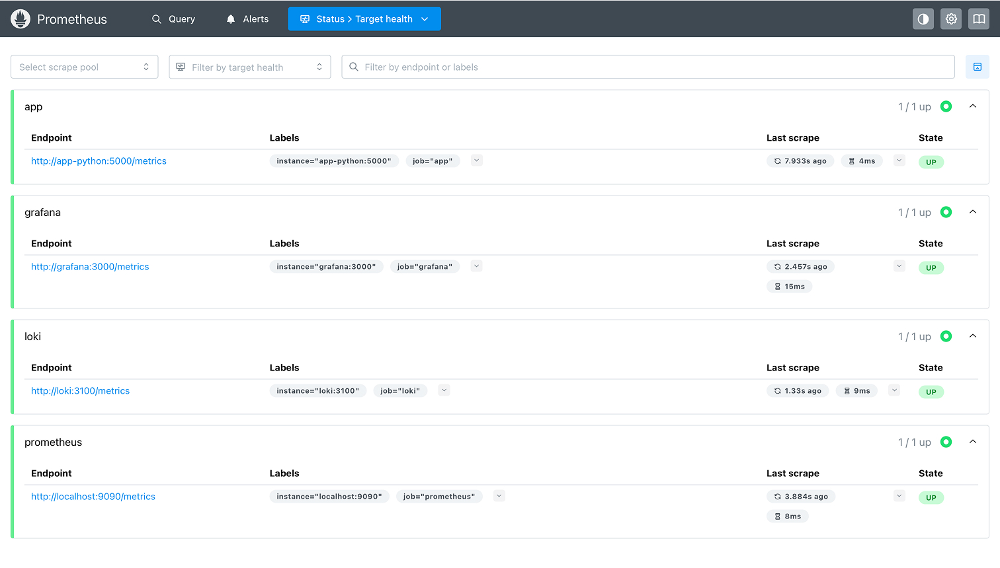
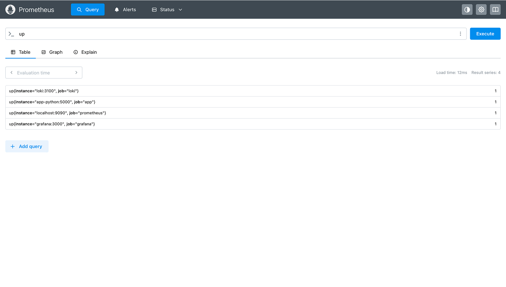
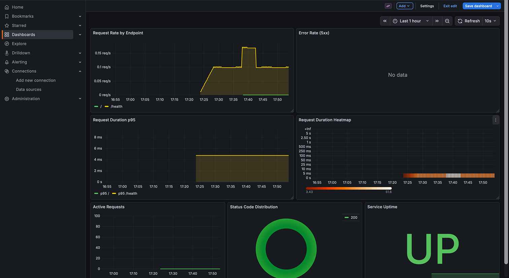
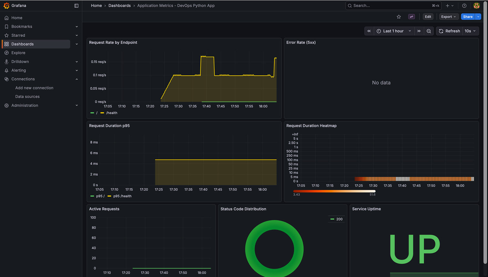
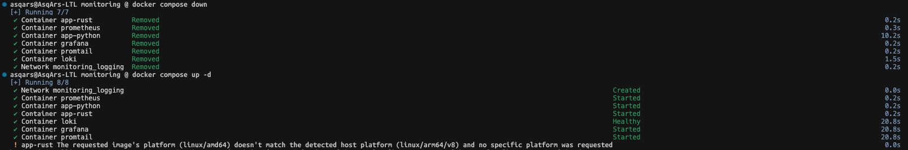
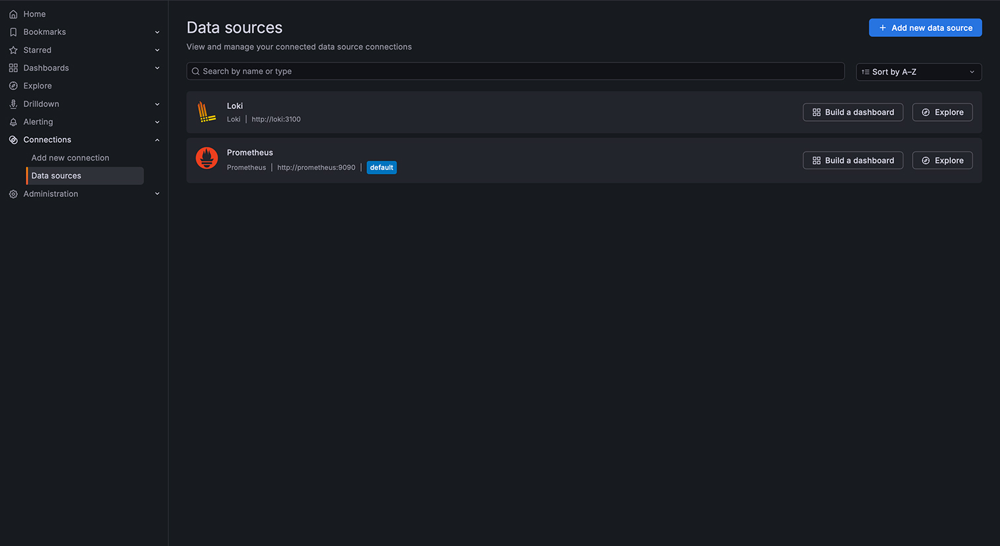
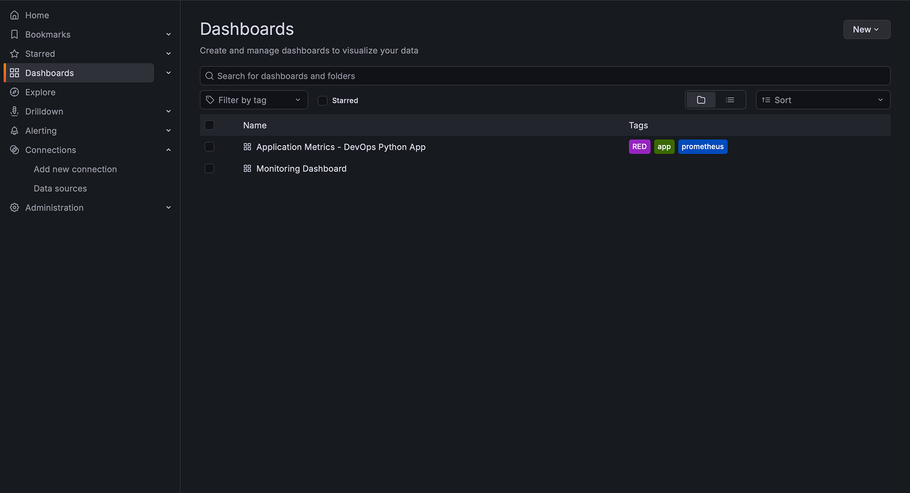

# Lab 8: Metrics & Monitoring with Prometheus

This lab extends the observability stack from Lab 7 by adding Prometheus for
metrics collection. While Lab 7 focused on logging with Loki, this lab adds
metrics monitoring to get a complete picture of how the application is
performing.

The goal was to instrument the Python application with Prometheus metrics and
visualize them in Grafana alongside the existing log data.

## System Architecture

The monitoring stack now includes Prometheus alongside Loki and Grafana:

- `app-python:5000` (internal) / `app-rust:8080` (internal) — Applications
  expose Prometheus metrics at `/metrics`
- `prometheus:9090` — Scrapes metrics from all services every 15 seconds
- `loki:3100` — Continues handling log aggregation from Lab 7
- `grafana:3000` — Visualizes both logs (Loki) and metrics (Prometheus)

**Components:**

- **Prometheus 3.9** — Metrics collection and storage. Configured to scrape all
  services every 15 seconds with 15-day data retention and 10GB storage limit.
- **Grafana 12.3** — Updated to include Prometheus as an additional data source
  alongside Loki for visualizing both metrics and logs.
- **Applications** — Python FastAPI app now exposes Prometheus metrics including
  HTTP request counts, duration histograms, endpoint call counters, and
  in-progress request gauge.

All containers communicate over a Docker bridge network called `logging`.
Prometheus uses static service discovery to scrape targets by their Docker
Compose service names.

## Getting Started

1. Navigate to the monitoring directory:

   ```bash
   cd monitoring/
   ```

2. Rebuild the Python app to include prometheus-client:

   ```bash
   docker compose build app-python
   ```

3. Start everything:

   ```bash
   docker compose up --detach
   ```

4. Check that all services are healthy:

   ```bash
   docker compose ps
   ```

5. Verify Prometheus is running:

   ```bash
   curl http://localhost:9090/-/healthy
   ```

**Task 1 Deliverable:**

- 

To generate test traffic and see metrics in action:

```bash
for i in {1..20}; do curl http://localhost:8000/; done
curl http://localhost:8000/metrics
```

## Application Instrumentation

The Python application was instrumented using the `prometheus-client` library.
Four custom metrics were added to track application behavior:

| Metric                          | Type      | Labels                   | Purpose                                      |
| ------------------------------- | --------- | ------------------------ | -------------------------------------------- |
| `http_requests_total`           | Counter   | method, endpoint, status | Total request count (RED: Rate)              |
| `http_request_duration_seconds` | Histogram | method, endpoint         | Request latency distribution (RED: Duration) |
| `http_requests_in_progress`     | Gauge     | —                        | Concurrent requests                          |
| `devops_info_endpoint_calls`    | Counter   | endpoint                 | Business-level endpoint usage                |

These metrics follow the **RED method** (Rate, Errors, Duration) which is
standard for monitoring request-driven applications:

- **Rate** — How many requests per second? (using `http_requests_total`)
- **Errors** — What's the error rate? (filtering by 5xx status codes)
- **Duration** — How long do requests take? (using histogram percentiles)

The `/metrics` endpoint is excluded from self-instrumentation to avoid inflating
the request counts — the middleware checks `if request.url.path ==
"/metrics"`
and skips metrics recording for that path.

The metrics are registered in `app_python/app.py` and served at `GET /metrics`
using FastAPI's `PlainTextResponse` with the proper Prometheus content type.

## Prometheus Configuration

The Prometheus configuration lives in `monitoring/prometheus/prometheus.yml`:

```yaml
global:
  scrape_interval: 15s
  evaluation_interval: 15s

scrape_configs:
  - job_name: "prometheus"
    static_configs:
      - targets: ["localhost:9090"]

  - job_name: "app"
    static_configs:
      - targets: ["app-python:5000"]
    metrics_path: "/metrics"

  - job_name: "loki"
    static_configs:
      - targets: ["loki:3100"]
    metrics_path: "/metrics"

  - job_name: "grafana"
    static_configs:
      - targets: ["grafana:3000"]
    metrics_path: "/metrics"
```

The scrape interval is set to 15 seconds, which is a good balance between timely
data and not overwhelming the targets with requests. The retention is 15 days or
10GB, whichever comes first.

**Task 2 Deliverables:**

- 
- 

## Grafana Dashboards

Grafana was configured with Prometheus as an additional data source. A custom
dashboard was created with seven panels:

| Panel # | Name                     | Type        | PromQL Query                                                                                      |
| ------- | ------------------------ | ----------- | ------------------------------------------------------------------------------------------------- |
| 1       | Request Rate             | Time series | `sum(rate(http_requests_total[5m])) by (endpoint)`                                                |
| 2       | Error Rate (5xx)         | Time series | `sum(rate(http_requests_total{status=~"5.."}[5m]))`                                               |
| 3       | Request Duration p95     | Time series | `histogram_quantile(0.95, sum(rate(http_request_duration_seconds_bucket[5m])) by (le, endpoint))` |
| 4       | Request Duration Heatmap | Heatmap     | `sum(increase(http_request_duration_seconds_bucket[5m])) by (le)`                                 |
| 5       | Active Requests          | Gauge       | `http_requests_in_progress`                                                                       |
| 6       | Status Distribution      | Pie chart   | `sum by (status) (rate(http_requests_total[5m]))`                                                 |
| 7       | Service Uptime           | Stat        | `up{job="app"}`                                                                                   |

The dashboard JSON was exported to
`monitoring/grafana/provisioning/dashboards/app-dashboard.json` and
auto-provisioned on startup.

**Task 3 Deliverables:**

- 

## Production Setup

All services now have health checks configured:

- **Prometheus:** `wget http://localhost:9090/-/healthy` — checks the built-in
  health endpoint
- **app-python:** Python urllib request to `/health` — verifies the app is
  responding
- **app-rust:** wget to `/health` — same for the Rust app
- **Loki:** `/ready` — existing from Lab 7
- **Grafana:** `/api/health` — existing from Lab 7

Resource limits are configured for all services:

| Service    | Memory | CPU |
| ---------- | ------ | --- |
| Prometheus | 1G     | 1.0 |
| Loki       | 1G     | 1.0 |
| Grafana    | 512M   | 1.0 |
| Apps       | 256M   | 0.5 |

The persistent volumes (`prometheus-data`, `loki-data`, `grafana-data`) ensure
data survives container restarts and `docker compose down/up` cycles.

**Task 4 Deliverables:**

- 
- 

## Useful Queries

Here are some PromQL queries for exploring metrics:

```promql
-- Request rate per endpoint
sum(rate(http_requests_total[5m])) by (endpoint)

-- Error percentage
sum(rate(http_requests_total{status=~"5.."}[5m])) / sum(rate(http_requests_total[5m])) * 100

-- 95th percentile latency
histogram_quantile(0.95, sum(rate(http_request_duration_seconds_bucket[5m])) by (le))

-- Services currently down
up == 0

-- Total requests in last hour
increase(http_requests_total[1h])
```

## Metrics vs Logs

| Aspect             | Metrics (Prometheus, Lab 8)             | Logs (Loki, Lab 7)                        |
| ------------------ | --------------------------------------- | ----------------------------------------- |
| Format             | Numeric time-series                     | Structured text/JSON events               |
| Use case           | Rates, aggregations, alerting, SLOs     | Debugging, audit trail, error details     |
| Query language     | PromQL                                  | LogQL                                     |
| Storage efficiency | Very efficient (only numbers)           | Larger (full text payloads)               |
| Cardinality        | Low (labels with few values)            | High (every log line is unique)           |
| When to use        | "How many requests?", "What's the p95?" | "What error message?", "Why did it fail?" |
| Retention          | 15 days (sufficient for trends)         | 7 days (sufficient for debugging)         |

Together they provide complete observability: metrics detect the problem (spike
in error rate), logs explain the cause (stack trace, error message).

## Automating with Ansible (Bonus)

The Ansible `monitoring` role was extended to include Prometheus. Key changes:

1. Added `prometheus_version`, `prometheus_port`, and retention variables
2. Created `prometheus_targets` list for flexible scrape target configuration
3. Added prometheus service to docker-compose template
4. Added health check wait for Prometheus in deploy.yml
5. Created templated `prometheus.yml.j2` from variables
6. Updated Grafana provisioning to include both Loki and Prometheus datasources
7. Added dashboard provisioning configuration

**Bonus Deliverables:**

- 
- 

The role is idempotent — running it multiple times produces the same result
without changes after the first deployment.

## Common Issues

A few things that can cause problems:

1. **Metrics endpoint inflating counts:** Make sure to skip `/metrics` in your
   request middleware, otherwise the metrics endpoint itself gets counted as a
   regular request.

2. **Container networking:** Use Docker Compose service names (like
   `app-python:5000`) for scrape targets, not `localhost`. Prometheus runs in
   its own container, so `localhost` would refer to the Prometheus container
   itself, not the app.

3. **Histogram bucket selection:** Choose buckets that match your expected
   latency range. For a lightweight API, `[5ms..5s]` is usually good. Too wide
   and you lose precision; too narrow and all requests overflow into the
   infinity bucket.

4. **High cardinality labels:** Avoid using high-cardinality values like user
   IDs or request IDs as labels. This can cause memory issues in Prometheus.
   Stick to endpoint paths, methods, and status codes.
